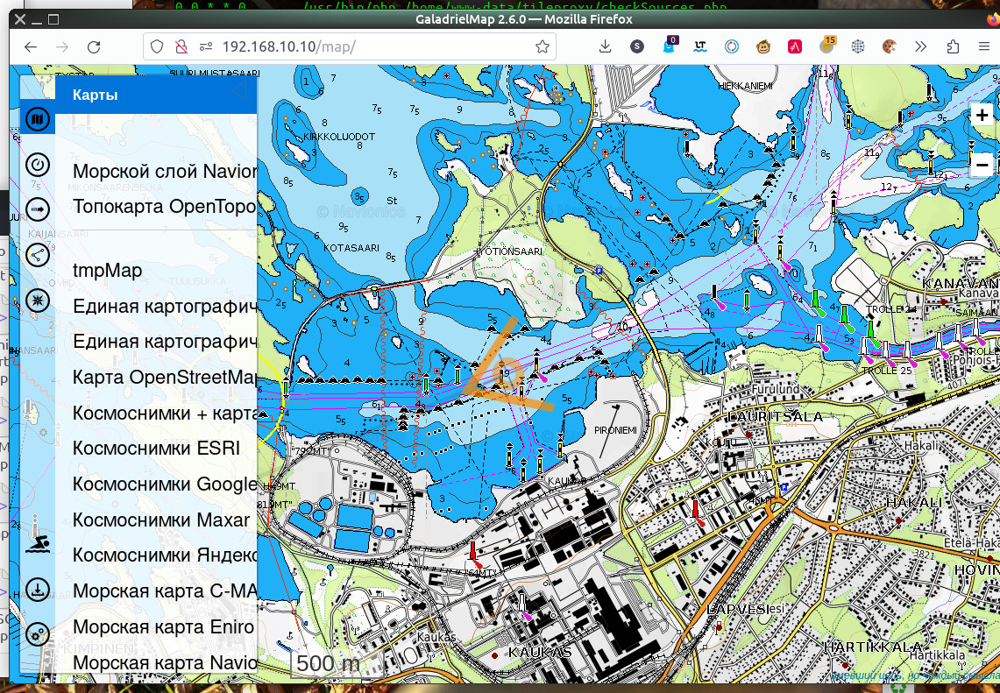
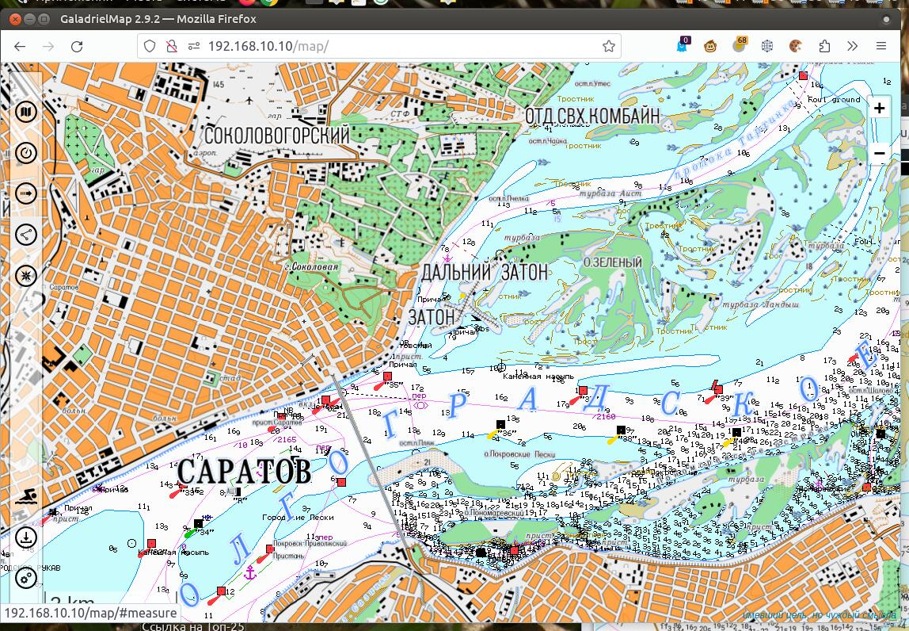
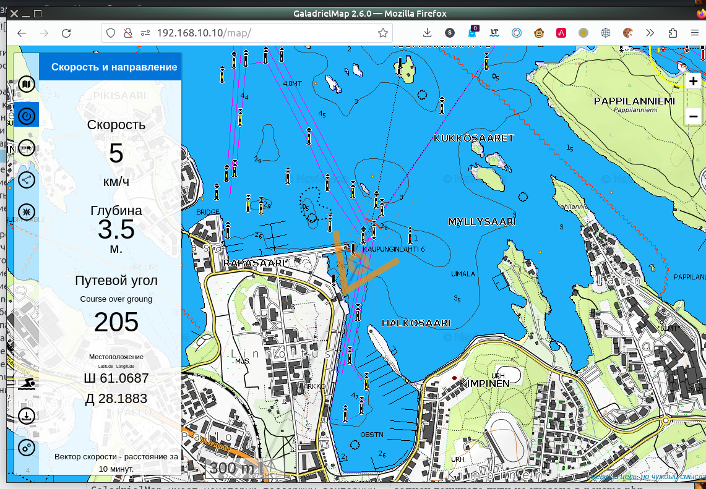
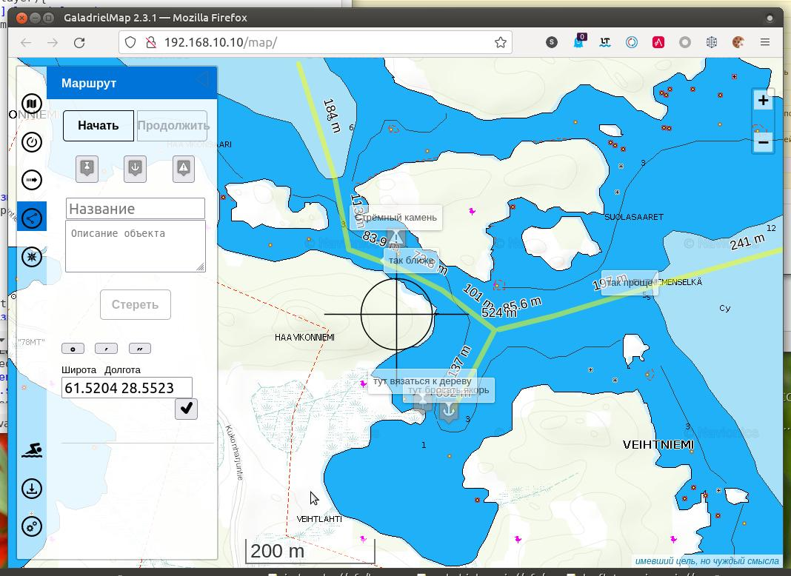
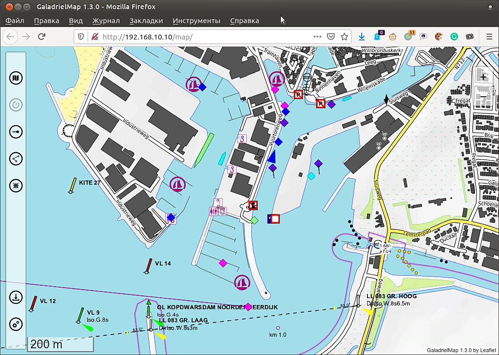
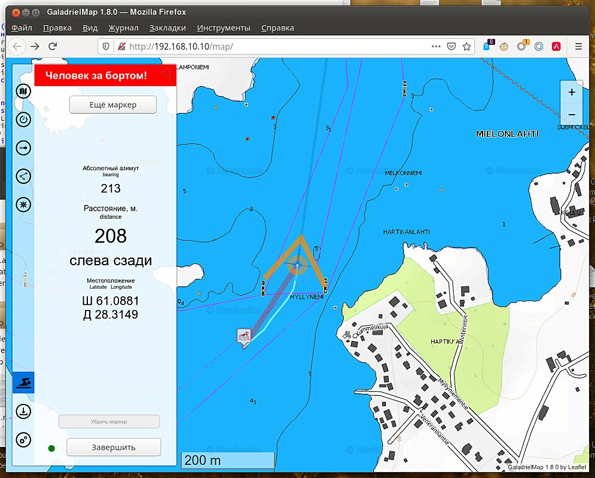
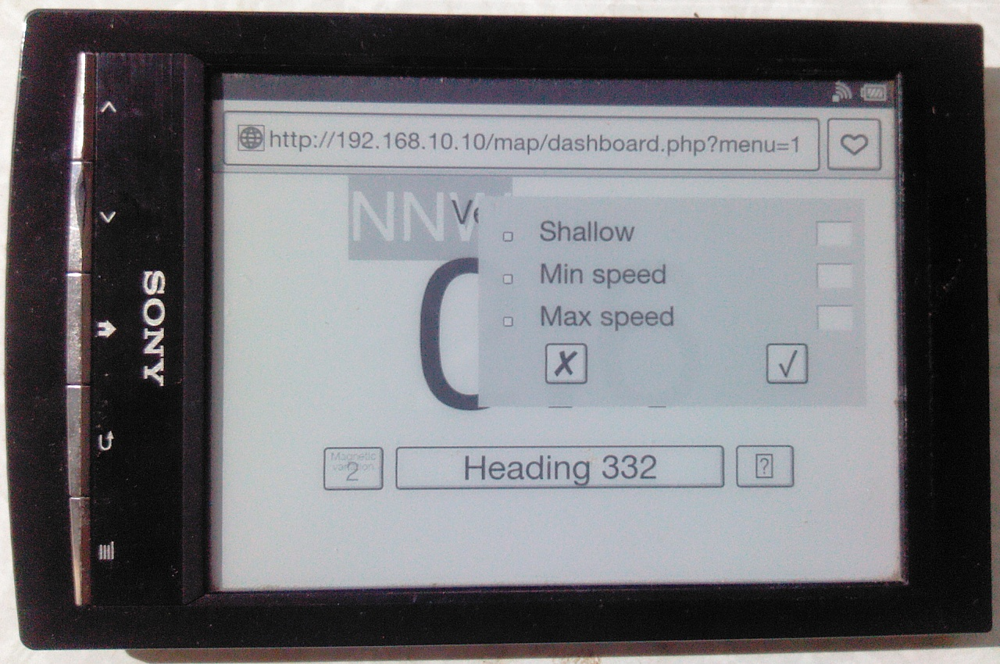
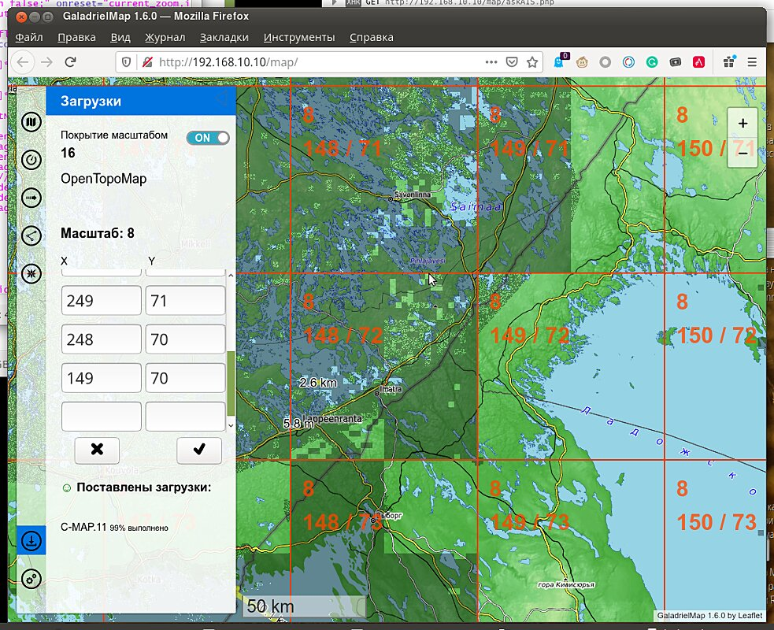

[In English](README.md) 
# GaladrielMap [](https://creativecommons.org/licenses/by-sa/4.0/)
Простой картплоттер (электронно-картографическая система, ЭКС), предназначенный для любительского использования на маломерных судах, в домах на колёсах и внедорожных автомобилях.  
Приложение может быть размещено на слабом сервере типа  RaspberryPi, NAS или сетевом маршрутизаторе и предполагает использование на достаточно производительных клиентских устройствах, преимущественно мобильных. Желательно применять планшет с большим экраном, однако пользоваться с телефона тоже можно. На клиентском устройстве требуется только наличие браузера -- никаких приложений устанавливать не нужно.
<div style='float:right;'><a href='https://github.com/VladimirKalachikhin/Galadriel-map/discussions'>Форум</a>
</div>

## v. 2.9
 <br>
Технически это веб-приложение -- просмотрщик тайловых онлайн карт. При использовании с  [GaladrielCache](https://github.com/VladimirKalachikhin/Galadriel-cache) становится возможным предварительное скачивание и последующий просмотр карт без подключения к сети Интернет.  
Предполагается, что приложение функционирует в локальной  бортовой сети катера, яхты или автомобиля, поэтому никакого разграничения доступа к функциям не предусмотрено.
Автор пользуется GaladrielMap на своей яхте Galadriel, где в качестве сервера применяется [wi-fi маршрутизатор под управлением OpenWRT](https://github.com/VladimirKalachikhin/MT7620_openwrt_firmware) .   

**Внимание! Автор не несёт никакой ответственности за последствия использования GaladrielMap для навигации! Не гарантируется также, что какая-либо информация, представляемая приложением, верна, включая пространственное положение, скорость, глубину и любые другие характеристики.** 

Приложение GaladrielMap создано на основе  замечательных проектов многих, без сомнения, выдающихся авторов, поэтому необходимо вручную установить большое количество [зависимостей](#зависимости-и-благодарности).  

## Возможности:
1. [Конфигурируемые пользователем локальные или сетевые карты](#карты)
2. [Отображение положения](#отображение-положения)
3. [Запись пути](#текущий-путь)
4. [Отображение маршрутов](#отображение-маршрутов), путевых точек и точек достопримечательностей
5. [Создание и редактирование маршрута](#создание-и-редактирование-маршрута)
6. [Ввод и получение координат](#ввод-и-получение-координат)
7. [Прогноз погоды](#прогноз-погоды) от  [Thomas Krüger Weather Service](http://weather.openportguide.de/index.php/en/)
8. [Отображение информации AIS](#отображение-информации-ais)
9. [Обнаружение столкновений](#обнаружение-столкновений)
10. [Поддержка netAIS](#поддержка-netais)
11. [Режим "Человек за бортом!"](#человек-за-бортом)
12. Отдельная [приборная панель](#приборная-панель), оптимизированная для устройств с экраном на "электронных чернилах" (E-Ink)
13. [Управление скачиванием карт](#загрузчик-galadrielcache)
14. Русский и английский интерфейс

* [Работает в OpenWRT](#работа-в-openwrt)
* [Работает в VenusOS](#работа-в-venusos)

 [Поддержка](#поддержка)


## Совместимость
Требуется Linux (OpenWRT, VenusOS) и PHP7 на сервере и более-менее современный браузер на клиентском устройстве.


## Демо
~~Полнофункциональная [демонстрация](http://130.61.159.53/map/). Иногда там плавает виртуальный кораблик.~~  
К сожалению, Oracle Inc оказались жуликами, поэтому демо не работает.

## Готовые образы машин
[Имется](https://github.com/VladimirKalachikhin/GaladrielMap-Demo-image/blob/master/README.ru-RU.md) настроенный и готовый к запуску образ виртуальной машины в общепринятом формате, а также загрузочный образ для Raspberry Pi, также настроенный и готовый к работе с первого запуска. Образы содержат GaladrielMap, GaladrielCache, netAIS, gpsd, gpxlogger и всё остальное, что необходимо для функционирования полноценного бортового сервера.

## Установка и конфигурирование:
Требуется веб-сервер под управлением Linux с поддержкой php < 8. Скопируйте приложение и установите указанные ниже зависимости в желаемое место на веб-сервере.  
Укажите пути и другие параметры в _params.php_  
Более подробные инструкции имеются в каталоге _emergencykit/_

## Аварийный набор
Однако, всё, что необходимо для установки приложения, включая зависимости, находится в архиве в каталоге  _emergencykit/_. Нужно просто распаковать.  
Можно скачать комплект без поддержки векторных тайлов (без шрифтов, значков и библиотек) и без иллюстраций к этому тексту -- его размер менее 3MB, или полный комплект -- размером более 10MB.

## Зависимости и благодарности
* [Leaflet](https://leafletjs.com/) < 1.8, установленная в каталог _leaflet/_ 
* [Coordinate Parser](https://github.com/servant-of-god/coordinate-parser) установленный в каталог _coordinate-parserPATCHED/_ 
* [L.TileLayer.Mercator](https://github.com/ScanEx/L.TileLayer.Mercator) установленная как _L.TileLayer.Mercator/src/L.TileLayer.Mercator.js_
* [Leaflet.Editable](https://github.com/Leaflet/Leaflet.Editable) установленная в каталог _Leaflet.Editable/_ 
* [Leaflet.RotatedMarker](https://github.com/bbecquet/Leaflet.RotatedMarker) установленная как _Leaflet.RotatedMarker/leaflet.rotatedMarker.js_
* [Leaflet Measure Path](https://github.com/ProminentEdge/leaflet-measure-path) установленная в каталог _leaflet-measure-path/_ 
* [leaflet-sidebar-v2](https://github.com/nickpeihl/leaflet-sidebar-v2) установленный в каталог _leaflet-sidebar-v2/_ 
* [supercluster](https://github.com/mapbox/supercluster) установленный как _supercluster/dist/supercluster.js_
* [gpsdPROXY](https://github.com/VladimirKalachikhin/gpsdPROXY) в каталоге _gpsdPROXY/_ 
* [mapbox-gl-js](https://github.com/mapbox/mapbox-gl-js) установленная в каталог _mapbox-gl-js/dist/_ 
* [mapbox-gl-leaflet](https://github.com/mapbox/mapbox-gl-leaflet) установленная как _mapbox-gl-leaflet/leaflet-mapbox-gl.js_
* [gpsdPROXY](https://github.com/VladimirKalachikhin/gpsdPROXY) в _gpsdPROXY/_ directory
* [polycolorRenderer](https://github.com/VladimirKalachikhin/polycolorRenderer) установленная в каталог _polycolor/_  
* [value2color](https://github.com/VladimirKalachikhin/value2color) установленная в каталог _value2color/_
* [long-press-event](https://github.com/john-doherty/long-press-event) как _long-press-event/dist/long-press-event.min.js_

Для установки зависимостей нужно сделать локальную копию каждого проекта в каталоге приложения так, как это описано на сайте проекта, а потом, при необходимости, откорректировать пути в _index.php_

## Ещё благодарности
* [leaflet-omnivore](https://github.com/mapbox/leaflet-omnivore) за leaflet-omnivore. Этот продукт вдохновил на обширные усовершенствования.
* [Metrize Icons by Alessio Atzeni](https://icon-icons.com/pack/Metrize-Icons/1130) за использованные значки.
* [Typicons by Stephen Hutchings](https://icon-icons.com/pack/Typicons/1144) за использованные значки.
* [Map Icons Collection](https://mapicons.mapsmarker.com/) за использованные значки.
* [On/Off FlipSwitch](https://proto.io/freebies/onoff/)
* [leaflet-tracksymbol](https://github.com/lethexa/leaflet-tracksymbol) на основе которого сделано отображение данных AIS
* [openmaptiles](https://github.com/openmaptiles/fonts) за Open Font Glyphs for GL Styles
* [GitHub MAPBOX project](https://github.com/mapbox) за навигационные значки
* [OpenMapTiles](https://github.com/openmaptiles) за Mapbox GL basemap style
* [leaflet-ais-tracksymbol](https://github.com/PowerPan/leaflet-ais-tracksymbol) , откуда позаимствованы идеи и немножко кода

## Карты
В GaladrielMap используются [тайловые карты](https://wiki.openstreetmap.org/wiki/Tiles) в разграфке, принятой для [OSM](https://wiki.openstreetmap.org). Основной формат -- растровые тайлы, но могут быть использованы и векторные тайлы в формате [Mapbox](https://www.mapbox.com/).  
<br>
В сочетании с [GaladrielCache](https://github.com/VladimirKalachikhin/Galadriel-cache) (что предполагается по-умолчанию) одновременно может быть показано любой число карт, наложенных друг на друга (география + гидрография + погода, например) из сети Интернет и/или из локального хранилища. При этом возможна трансформация растровых тайлов "на лету", для, например, замены сплошного цвета на прозрачный, что делает полезным наложение исходно непрозрачной карты:  
<br>

Конфигурация карт определяется пользоватетем и описана в документации к [GaladrielCache](https://github.com/VladimirKalachikhin/Galadriel-cache). Как минимум, среди карт уже есть [Open Sea Map](http://www.openseamap.org/) и [Open Topo Map](https://opentopomap.org/about).  
Для удобства переключения между несколькими часто используемыми картами можно выделить их долгим нажатием (или жестом вправо) в полном списке карт, и перейти к списку избранных карт.

### Векторные тайлы
GaladrielMap имеет некоторую поддержку векторных тайлов в формате [Mapbox](https://www.mapbox.com/). Такие карты могут отображаться.  
Описывающий карту файл[Mapbox style](https://docs.mapbox.com/mapbox-gl-js/style-spec/) должен находиться в каталоге `$mapSourcesDir` GaladrielCache, и называться также, как файл источника карты, но с расширением **.json**. В файле Mapbox style можно использовать значки и шрифты (Sprites and glyphs) из каталога _styles/_ .

## Отображение положения
GaladrielMap получает координаты, скорость, направление от работающего на сервере сервиса [gpsd](https://gpsd.io/).  
 <br>
 Установка и конфигурирование gpsd описаны в [документации к gpsd](https://gpsd.io/). Обычно никакой настройки не требуется: достаточно просто подсоединить приёмник ГПС в гнездо usb, и координаты сразу начнут отображаться в GaladrielMap.

Кроме того, GaladrielMap может получать координаты от VenusOS или Signal K, локально или по сети. Если GaladrielMap не может подключиться к **gpsd**, предпринимается попытка обнаружить Signal K, а затем VenusOS и получить данные оттуда.
 
 Если координаты имеются -- карта **всегда** позиционируется на экране в соответсвии с текущим положением. Это поведение можно временно отключить в меню настроек .  
 Также следование за курсором отключается, если открыты панели  и .   
Курсор положения указывает **курс** судна, а вектор скорости -- его **путевой угол**, если оба параметра сообщаются источником данных. Если есть что-то одно, то курсор и вектор скорости имеют то направление, которое указано в панели 

## Текущий путь
GaladrielMap может показывать текущий путь по мере его записи.  
Для записи текущего пути на сервере используется приложение `gpxlogger`  из комплекта gpsd-clients, имеющегося в дистрибутивах, но устанавливаемого отдельно. Конфигурирование `gpxlogger` описано в документации к [gpsd](https://gpsd.io/).  Записью пути включается на вкладке .  
Вместо `gpxlogger` можно использовать любую другую работающую на сервере программу, записывающую текущий путь в формате gpx. Она указывается в файле настройки _params.php_. Даже если средство записи текущего пути не указано в _params.php_, текущий путь всё равно будет обновляться на экране по мере записи, если имя записываемого файла будет соответствовать имени "текущего пути", как это указано в _params.php_.
Если запись текущего пути внезапно прервалась, и на диске остался некорректный файл gpx, его можно поправить, запустив
```
php chkGPXfiles.php
```
Текущий путь записывается в папку _tracks_ (в папку, указанную в переменной $trackDir конфигурационного файла _params.php_).

## Отображение маршрутов
GaladrielMap показывает пути и маршруты а также точки достопримечательностей, записанные в форматах gpx, kml и csv:  
 <br>
 Файлы располагаются на сервере в папке _route_ (как она указана в файле конфигурации _params.php_). Откройте панель .  
Если в пути gpx записана глубина, она может быть показана цветом линии пути, в соответствии с настройками в _params.php_
 
### CSV
Текстовый файл в формате Comma-Separated Values -- самый простой способ заранее подготовить список интересующих точек (POI) для предстоящего путешествия. Для создания такого файла нужен только текстовый редактор, хотя удобней будет любой табличный процессор.  
Первой строкой в csv файле должны быть наименования колонок. GaladrielMap понимает следующие наименования:  
`"number","name","comment","desc","symb","url","lat","lon"`  
как это рекомендуется в [документации к _gpsbabel_](https://www.gpsbabel.org/htmldoc-1.7.0/fmt_unicsv.html),
хотя минимально-полезный набор состоит из  
`"name","latitude","longitude"`  
В файле возможны и другие колонки, но информация из них, скорее всего, на карте показана не будет.  
Широту и долготу можно указывать почти в любом формате, как в градусах, минутах и секундах -- 61°04'50"N, например, так и в десятичных градусах.  
Примером реального использования файла csv для обмена информацией о маринах и природных стоянках на озере Сайма в Финляндии может быть начинание [SaimaaPOI](https://github.com/VladimirKalachikhin/Saimaa-POI). Там же имеется файл csv с точками фотографирования и с ссылками на фотографии.  
Файл с путевыми точками надо положить в папку _route_ на сервере (в папку, указанную в переменной $routeDir конфигурационного файла _params.php_). Следует избегать совпадений имён файлов в папках _route_ и _tracks_.

## Создание и редактирование маршрута
Планирование маршрута происходит на клиентском устройстве, при этом имеется возможностью сохранить маршрут на сервере в формате gpx.  
 <br>
Инструменты для планирования и редактирования маршрута и путевых точек находятся на панели . Созданный маршрут автоматически сохраняется на клиентском устройстве (и на выключенном), а на сервер сохраняется нажатием кнопки.  
Этот инструмент может быть использован и для редактирования существующего маршрута в формате gpx, загруженного с сервера через панель  . Если редактируемый маршрут показывается ещё на каком-то устройстве, то после сохранения на сервере он сразу отобразится на этом устройстве в изменённом виде.  
Это может быть полезно, если нужно из тёплой рубки уточнить маршрут находящемуся под ветром и дождём рулевому.  
Однако, инструмент имеет только самую базовую поддержку gpx, ограниченную возможностями формата GeoJSON, в который программа переводит все загружаемые пути, маршруты и путевые точки. Поэтому никакие свойства узлов путей и маршрутов, кроме координат, не поддерживаются (включая, и особенно, отметку времени узлов пути, а также любимые GARMIN &lt;extensions&gt;, где хранится, в частности, глубина), и будут утеряны при сохранении. Поэтому следует быть осторожным при редактировании сторонних файлов gpx.  
Также следует проявлять осторожность (и отключить возможность автоматического обновления маршрутов в  _params.php_), если существует возможность неадекватного редактирования маршрута со стороны детей или гостей.

 При наличии Интернет можно искать объекты по географическому наименованию или почтовому адресу, и наоборот -- получить ближайшее к координатам центра экрана географическое название или адрес. Для этого воспользуйтесь текстовым полем ввода.
 
## Ввод и получение координат
Для получения текущего положения нажмите на цифры координат на панели  . Координаты будут скопированы в буфер обмена. Можно вставить их в sms, мессенджер или письмо.  
Аналогично, координаты маркированной точки на карте могут быть получены нажатим на наименование точки в всплывающем окне этой точки.

Получить координаты произвольной точки на карте можно, открыв панель . Координаты перекрестия будут отображаться в текстовом поле. Если же, наоборот, ввести в это поле какие-либо координаты (широту и долготу, почти в любом формате), и нажать кнопку рядом -- карта переместиться так, что перекрестие будет указывать в эту точку. Кнопки над текстовым полем помогут ввести знаки градусов и минут.
 
## Прогноз погоды
Прогноз погоды от [Thomas Krüger Weather Service](http://weather.openportguide.de/index.php/en/)
 <br>
 На трое суток, с интервалом в 6 часов. Доступны сила ветра, давление, температура, осадки и волнение моря в любых сочетаниях.
 
## Отображение информации AIS 
 <br>
 Сбор данных AIS осуществляется от [gpsd](https://gpsd.io/) через [gpsdPROXY](https://github.com/VladimirKalachikhin/gpsdPROXY), или напрямую из среды [Signal K](https://signalk.org/). Демону **gpsd** может понадобится некоторая настройка для получения данных от приёмопередатчика AIS. Если же имеется только usb приёмник AIS -- никакой настройки обычно не требуется.  
Получение информации AIS по умолчанию отключено. Его можно включить, раскомментировав строку с переменной $aisServerURI в файле _params.php_. Временно отключить отображение информации AIS можно переключателем в меню .

Поскольку для получения информации AIS от **gpsd** необходим [gpsdPROXY](https://github.com/VladimirKalachikhin/gpsdPROXY) -- установите соответствующие значения переменных $gpsdHost и $gpsdPort в файле _params.php_
 
## Обнаружение столкновений
<br>  
Картплоттер отображает информацию об опасности столкновений, вычисляемую gpsdPROXY. Потенциально опасные цели AIS подсвечиваются, и вокруг курсора собственного положения размещаются стрелочки, указывающие на опасный объект.  
Не следует чрезмерно полагаться на систему обнаружения столкновений. Помните, что **никакая информация, выданная или не выданная системой обнаружения столкновений, не может служить основанием для действия или бездействия судоводителя.** Будте внимательны.  

## Поддержка netAIS
[netAIS](https://github.com/VladimirKalachikhin/netAIS/blob/master/README.ru-RU.md) -- сервис обмена информацией о местоположении через интернет. Обмен идёт внутри приватных групп, никаких централизованных серверов не нужно.  
<br>
GaladrielMap поддерживает все возможности сервиса, отображая и нестандартные статусы и текстовые сообщения.
 
## Человек за бортом
<br>
Нажатие на кнопку  включает режим "Человек за бортом!" При этом активируется запись маршрута, ставится маркер в точке нажатия на кнопку и на карте рисуется линия от текущего положения к точке маркера. Информация сохраняется на сервере. На открывшейся панели отображается направление и расстояние до маркера.  
Имеется возможность установить ещё маркеры и передвинуть существующие. Линия от текущего положения протягивается к последнему установленному маркеру или к тому, на который нажали.  
Информация "Человек за бортом!" и все её изменения распространяется на все подключенные компьютеры, и может быть изменена с любого из них.  
Для завершения режима "Человек за бортом!" нужно предварительно нажать на серую точку слева от кнопки.

## Приборная панель
 _dashboard.php_ -- отдельное приложение, предназначенное для показа некоторых имеющихся приборов на очень слабых и/или медленных клиентских устройствах. Например, на читалке электронных книг с E-ink экраном. Требуется только браузер:
<br>
<br>

[Демонстрация](http://130.61.159.53/map/dashboard.php)

Изображение на экране оптимизировано для различных разрешений и размеров экранов -- от самых маленьких до самых больших. Показывается истинная скорость, истинный или магнитный курс и глубина. Разумеется, соответствующие приборы должны быть подключены к [gpsd](https://gpsd.io/). При наличии только приёмника геопозиционирования доступны истинный курс и скорость.   генеральное направление всегда отображается серой маркой у края экрана.
Может быть запущено несколько экземпляров веб-приложения, отображающих разную информацию -- в разных окнах или на разных устройствах.
Существует возможность назначить визуальную и звуковую сигнализацию на некоторые параметры.  
<br>
Необходимо указать в настройках браузера разрешение воспроизводить звук. Сигнализация назначается отдельно на каждом клиентском устройстве, и сработает, только если устройство активно. Будьте внимательны!  
Если установлена сигнализация об отклонении от курса, то у края основного экрана всегда присутствуют отметки, точно указывающие требуемый курс (треугольник) и текущий курс (штрих): 
<br>
При достижении указанного отклонения от курса включается сигнализация:
<br>
По взаимному положению отметок текущего и требуемого курса можно оценить требуемое воздействие для выправления курса.

Предполагается, что клиентское устройство оснащено чувствительным к нажатию экраном, и управление приложением происходит нажатиями на экран.  
Выбор основного отображаемого параметра осуществляется средней кнопкой в нижней части экрана.  
При наличии поддержки javascript на некоторых клиентских устройствах можно настроить некоторые аппаратные клавиши для переключения режимов, вызова меню оповещений и переключения между истинным и магнитным курсом. Настройка аппаратных клавиш находится внизу окна оповещений. Нажмите .   
По-умолчанию используются:

* Стрелка вниз для следующего режима
* Стрелка вверх для предыдущего режима
* Правая клавиша Alt для вызова меню оповещений
* Клавиша M (латинская M) для переключения между истинным и магнитным курсом
 
Это приложение не использует никакого хитрого javascript и никаких замысловатых стилей, однако, если хочется видеть что-то, кроме скорости, настоятельно рекомендуется использовать [gpsdPROXY](https://github.com/VladimirKalachikhin/gpsdPROXY) как источник данных.

## Загрузчик GaladrielCache   
<br>
Указывается регион для загрузки, путём ввода номеров тайлов на панели или нажатием на номер тайла на карте, после чего по нажатию кнопки подтверждения сформированное задание передаётся на сервер и там запускается загрузчик.  
Загружаться будут все показываемые карт начиная от указанных тайлов и до тайлов максимального масштаба. Максимальный масштаб задаётся в кофигурационном файле.  
Загрузчик работает автономно, и переживёт выключение сервера -- после включения он запустится автоматически и будет работать до тех пор, пока не скачает всё указанное. Не указывайте пол-планеты: места на диске не хватит!  
Чтобы видеть, какие участки карты уже есть в кеше -- можно включить показ схемы покрытия.

## Работа в OpenWRT
На мощных компьютерах (типа Raspberry Pi) под управлением OpenWRT установка и конфигурирование GaladrielMap осуществляется так же, как на любых других компьтерах под управлением Linux.  
Для установки на маршрутизаторы/точки доступа может потребоваться специальная прошивка (например, [MT7620A based router OpenWRT firmware ](https://github.com/VladimirKalachikhin/MT7620_openwrt_firmware/blob/master/README.ru-RU.md)) из-за ограниченности ресурсов.

### Дополнительная кофигурация
В OpenWRT есть только один полноценный пользователь: _root_. Однако, при использовании (по крайней мере) php-fpm, веб-сервер по умолчанию запускается от пользователя _nobody_. Из-за этого некоторые функции GaladrielMap, в частности -- обеспечивающие устойчивость к потре связи и электричества -- работать не будут. Нужно, чтобы веб-сервер тоже запускался от _root_.  
Для этого:  
Измените файл `/etc/php7-fpm.d/www.conf`:  
```
;user = nobody
user = root
```
Измените файд `/etc/init.d/php7-fpm`:
```
#PROG="/usr/bin/php-fpm"
PROG="/usr/bin/php-fpm -R"
```
Прегрузитесь.

## Работа в VenusOS
GaladrielMap работает под управлением VenusOS по крайней мере начиная с версии v2.80~38 и во всяком случае на Raspberry Pi. Работоспособность на устройствах Victron Energy не проверялась.  
Для того, чтобы запустить GaladrielMap под VenusOS, нужно сделать следующее:

* установить php-cli . Откройте на устройстве ssh и выполните:

```
opkg update  
opkg install php-cli  
```

* включить сервис "MQTT on LAN". Откройте панель управления (web или на устройстве), и перейдите в меню Settings -> Services -> MQTT on LAN (SSL). Там выберите "Включить".
*  разумеется, требуется достаточное количество i-nodes на карте SD для хранения тайлов.

### Ограничения
* в VenusOS нет данных о глубине и нет данных AIS
* в VenusOS нет сервиса записи пути
* в VenusOS нет приложения tor, поэтому для функционирования netAIS и преодоления защиты от скачивания понадобится tor на другой машине
* данные в VenusOS не являются вполне достоверными, и должны использоваться с осторожностью
* Возможно, нужны те же изменения конфигурации, что и для OpenWRT.
 
## Поддержка

[Форум](https://github.com/VladimirKalachikhin/Galadriel-map/discussions)

Форум будет живее, если вы сделаете пожертвование на [ЮМани](https://sobe.ru/na/galadrielmap).

### Платно
Вы можете получить [индивидуальную консультацию](https://kwork.ru/training-consulting/20093293/konsultatsii-po-ustanovke-i-ispolzovaniyu-galadrielmap) по вопросам установки и использования GaladrielMap, описанию источников тайлов и другим вопросам.  

Можно заказать загрузочный образ требуемого размера для Raspberry Pi на основе Raspbian, OpenWRT или VenusOS, содержащий полностью сконфигурированную и готовую к использованию программу GaladrielMap. Обращайтесь на [galadrielmap@gmail.com](mailto:galadrielmap@gmail.com)   
Возможна запись этого образа на флэш-карту требуемого размера с последующей пересылкой бумажной почтой. Обращайтесь на [galadrielmap@gmail.com](mailto:galadrielmap@gmail.com)

Также можно заказать установку и конфигурирование GaladrielMap на маршрутизатор типа [MT7620A based router](https://github.com/VladimirKalachikhin/MT7620_openwrt_firmware) или другой. Возможна сборка специализированной прошивки. Обращайтесь на [galadrielmap@gmail.com](mailto:galadrielmap@gmail.com)   
