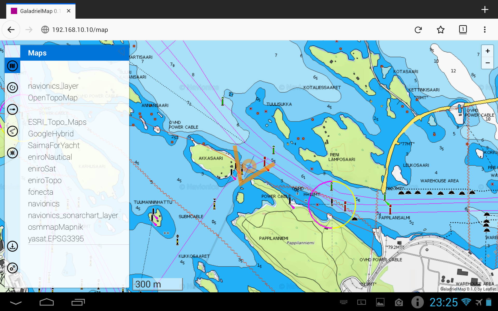
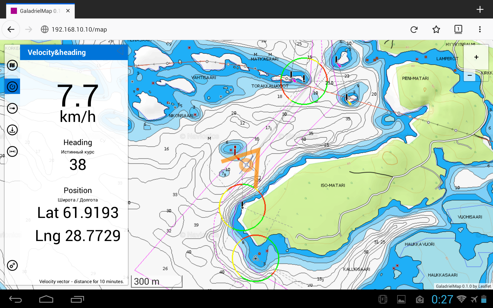
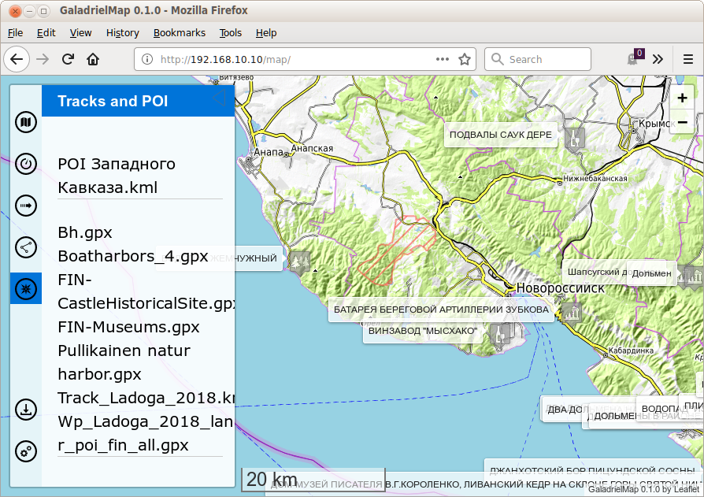
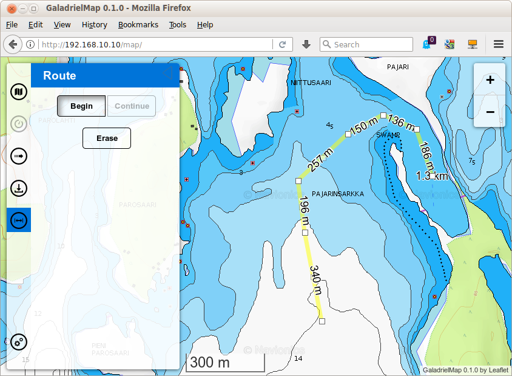
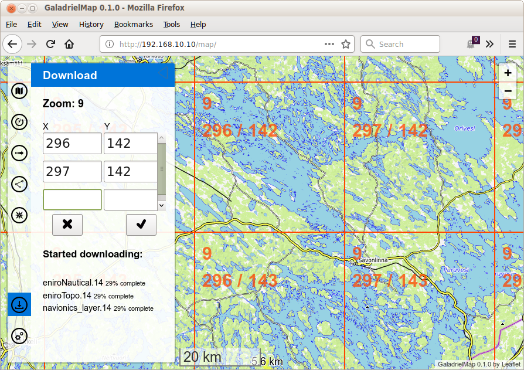

# GaladrielMap
This is a web tile map viewer to serve on a weak computers such as RaspberryPi or NAS and for use on a thick clients such as tablets and smartphones. It is assumed that the in onboard network of pleasure boats or campers. Author use it from the wi-fi router/GSM modem under OpenWRT on his sailboat "Galadriel". 
GaladrielMap designed for use mainly with [GaladrielCache](https://github.com/VladimirKalachikhin/Galadriel-cache), but may be used with any tile OSM-like map sources or file tile cache for explore map. The author is not responsible for the consequences of using the GaladrielMap as navigator!

## v. 0.1

## Features:
1. View one OSM-like on-line map or
2. stacked any number of maps with GaladrielCache
 
3. Positioning via gpsd and display current (writing now) track file in gpx format
 
4. Display routes and POIs files in gpx and kml format
 
5. Creating a route localy and save it to server in gpx format
 
6. Control the GaladrielCache Loader
 

## Compatibility
Linux. Modern browsers, include mobile.

## Install&configure:
You must have a web server under Linux with php support. Just copy. 
Paths and other are set and describe in _params.php_

### Dependences
* [Leaflet](https://leafletjs.com/) in _leaflet/_ directory
* [leaflet-realtime](https://github.com/perliedman/leaflet-realtime) as _leaflet-realtime/dist/leaflet-realtime.js_
* [Leaflet.RotatedMarker](https://github.com/bbecquet/Leaflet.RotatedMarker) as _Leaflet.RotatedMarker/leaflet.rotatedMarker.js_
* [L.TileLayer.Mercator](https://github.com/ScanEx/L.TileLayer.Mercator) as _L.TileLayer.Mercator/src/L.TileLayer.Mercator.js_
* [leaflet-sidebar-v2](https://github.com/nickpeihl/leaflet-sidebar-v2) in _leaflet-sidebar-v2/_ directory
* [Leaflet.Editable](https://github.com/Leaflet/Leaflet.Editable) in _Leaflet.Editable/_ directory
* [Leaflet Measure Path](https://github.com/ProminentEdge/leaflet-measure-path) in _leaflet-measure-path/_ directory
 For more compability:
* [fetch polyfill](https://github.com/github/fetch/) as _fetch/fetch.js_
* [promise-polyfill](https://github.com/taylorhakes/promise-polyfill) as _promise-polyfill/promise.js_

Create local copy of dependences and/or edit _index.php_

### Thanks
* [leaflet-omnivore](https://github.com/mapbox/leaflet-omnivore) for leaflet-omnivore. This patched to show markers and non well-formed gpx files.
* [Metrize Icons by Alessio Atzeni](https://icon-icons.com/pack/Metrize-Icons/1130) for icons.
* [Typicons by Stephen Hutchings](https://icon-icons.com/pack/Typicons/1144) for icons.
* [Map Icons Collection](https://mapicons.mapsmarker.com/) for icons.
* [On/Off FlipSwitch](https://proto.io/freebies/onoff/)

### gpsd
GaladrielMap get position and velosity from gpsd via _askGPSD.php_ service. You may configure _askGPSD.php_ to you gpsd host and port. Default are localhost and 2947 port (default for gpsd). 
How to install and configure gpsd see [gpsd pages](http://www.catb.org/gpsd/).

### tracks
You may use gpxlogger app from gpsd-clients packet to logging track on your server. GaladrielMap displaying current track as not well-formed gpx file. Other tracks may be diplayed simultaneously. 
Run _chkGPXfiles.php_ in cli to repair non well-formed gpx files for other applications.

