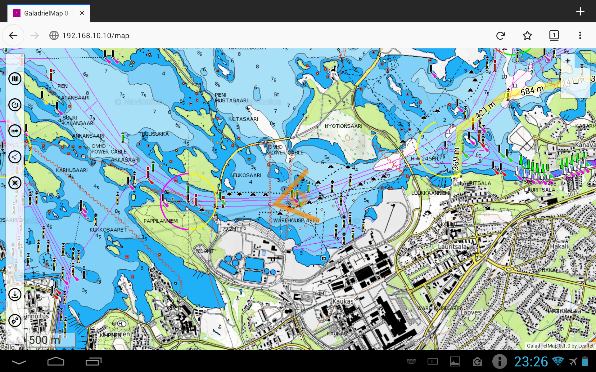
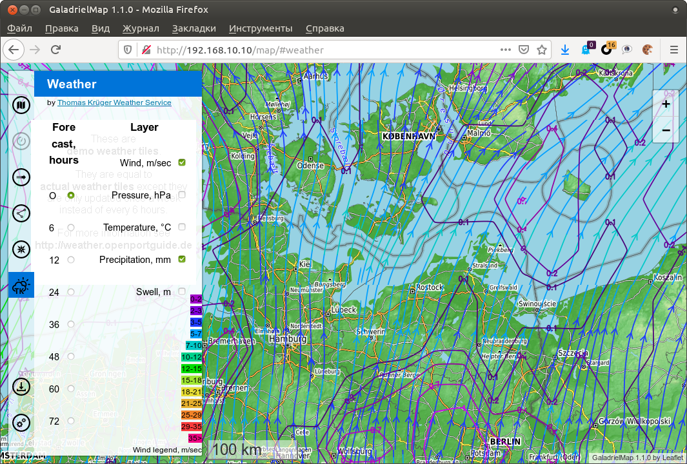
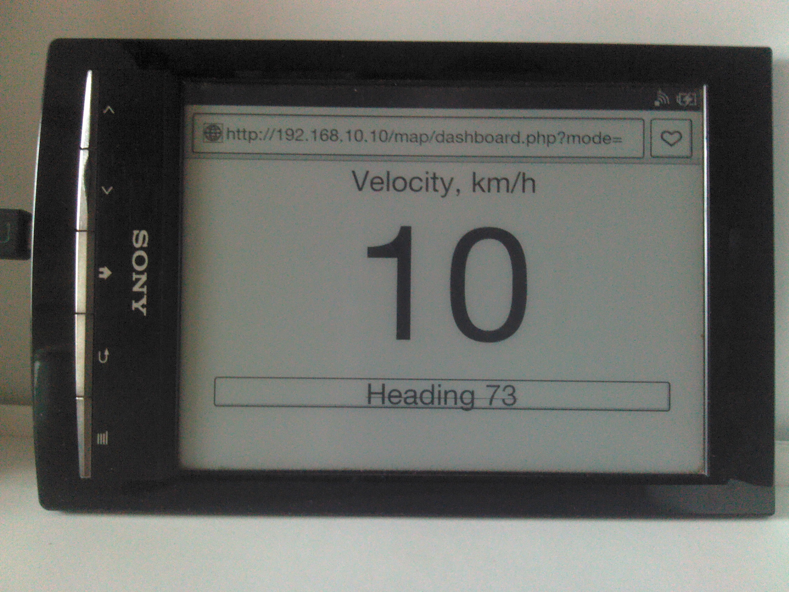
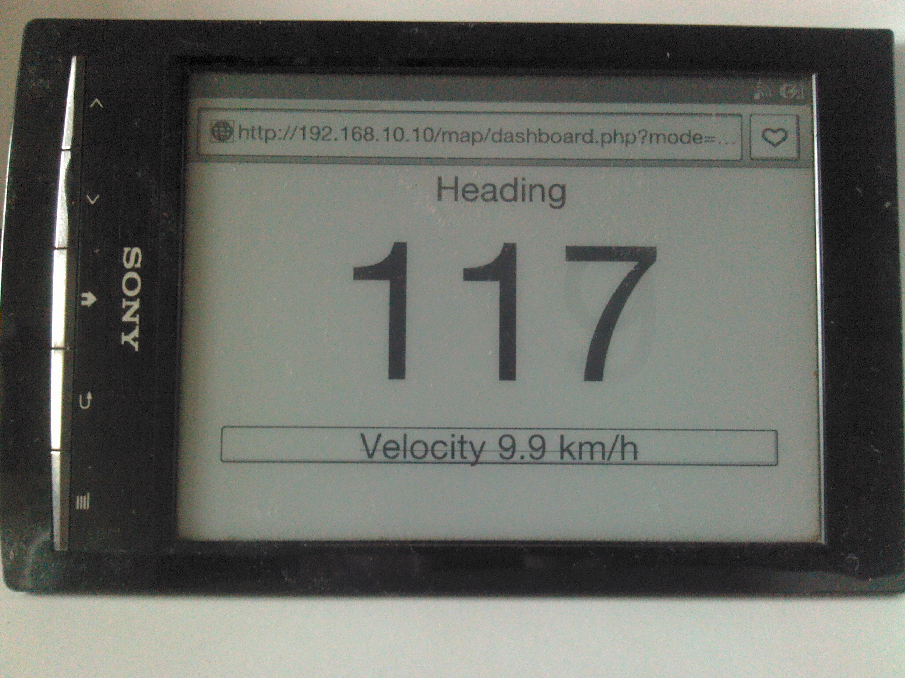

 

 [{width=32px}](README.ru-RU.md)
 

# GaladrielMap
This is a web application - the tiles map viewer. The application can be placed on a weak server such as RaspberryPi or NAS and used on full clients such as tablets and smartphones. Only browser need.  
It is assumed that the application is used in the onboard local area network of the boat or camper. The author uses it from the wi-fi router/GSM modem under OpenWRT as a server on his sailboat "Galadriel".  
The GaladrielMap designed for use mainly with [GaladrielCache](https://github.com/VladimirKalachikhin/Galadriel-cache) but may be used with any tile OSM-like map sources or file tile cache for exploring the map.  
The GaladrielMap created with use a lot of famous projects, so don't forget to install [dependenses](#dependences-and-thanks).  
The author is not responsible for the consequences of using the GaladrielMap as a navigator!

## v. 1.2
 

## Features:
1. View one OSM-like on-line map or  
2. with [GaladrielCache](https://github.com/VladimirKalachikhin/Galadriel-cache) the stacked maps  
[Open Sea Map](http://www.openseamap.org/)  
[Open Topo Map](https://opentopomap.org/about)  
 or any number of other maps:  
 
 
3. Positioning via [gpsd](https://gpsd.gitlab.io/) and display current (writing now) track file in gpx format:  
 
 
4. Display routes and POIs files in gpx, kml and csv format:  
 
 
5. Creating a route localy and save it to the server in gpx format (description below):  
 
 
6. Exchange coordinates via clipboard (see screenshot above and description below)  

7.  Weather forecast from [Thomas Krüger Weather Service](http://weather.openportguide.de/index.php/en/) (with GaladrielCache v.1.3 or above)  
 
 
8. Control the GaladrielCache Loader:   
 
 
9. Dashboard. 
 _dashboard.php_ - separate app to display velocity and heading on weak (and/or old) devices, such as E-ink readers, for example. 
 No javascript, no fanciful css.  
 
 

## Compatibility
Linux. Modern browsers include mobile.

## Install&configure:
You must have a web server under Linux with php support. Just copy app, dependences and set paths.  
Paths and other are set and describe in _params.php_

## Dependences and thanks
* [Leaflet](https://leafletjs.com/) in _leaflet/_ directory
* [leaflet-realtime](https://github.com/perliedman/leaflet-realtime) as _leaflet-realtime/dist/leaflet-realtime.js_
* [Leaflet.RotatedMarker](https://github.com/bbecquet/Leaflet.RotatedMarker) as _Leaflet.RotatedMarker/leaflet.rotatedMarker.js_
* [L.TileLayer.Mercator](https://github.com/ScanEx/L.TileLayer.Mercator) as _L.TileLayer.Mercator/src/L.TileLayer.Mercator.js_
* [leaflet-sidebar-v2](https://github.com/nickpeihl/leaflet-sidebar-v2) in _leaflet-sidebar-v2/_ directory
* [Leaflet.Editable](https://github.com/Leaflet/Leaflet.Editable) in _Leaflet.Editable/_ directory
* [Leaflet Measure Path](https://github.com/ProminentEdge/leaflet-measure-path) in _leaflet-measure-path/_ directory
* [supercluster](https://github.com/mapbox/supercluster) as _supercluster/supercluster.js_
* [Coordinate Parser](https://github.com/servant-of-god/coordinate-parser) in _coordinate-parser/_ directory
 For more compability:
* [fetch polyfill](https://github.com/github/fetch/) as _fetch/fetch.js_
* [promise-polyfill](https://github.com/taylorhakes/promise-polyfill) as _promise-polyfill/promise.js_

Create a local copy of dependences and/or edit _index.php_

## Emergency kit
All you need to install, including dependences, are in _distr/_.

## More thanks
* [leaflet-omnivore](https://github.com/mapbox/leaflet-omnivore) for leaflet-omnivore. This patched to show markers and non well-formed gpx files.
* [Metrize Icons by Alessio Atzeni](https://icon-icons.com/pack/Metrize-Icons/1130) for icons.
* [Typicons by Stephen Hutchings](https://icon-icons.com/pack/Typicons/1144) for icons.
* [Map Icons Collection](https://mapicons.mapsmarker.com/) for icons.
* [On/Off FlipSwitch](https://proto.io/freebies/onoff/)

## gpsd
GaladrielMap get position and velocity from  [gpsd](https://gpsd.gitlab.io/) via _askGPSD.php_ service. You may configure _askGPSD.php_ to you gpsd host and port. Defaults are localhost and 2947 port (default for gpsd). 
How to install and configure gpsd see [gpsd pages](https://gpsd.gitlab.io/).

## Tracks
You may use `gpxlogger` app from gpsd-clients packet to logging track on your server. GaladrielMap displaying current track as a not well-formed gpx file. Other tracks may be displayed simultaneously.  
Run _chkGPXfiles.php_ in cli to repair non-well-formed gpx files for other applications.

## CSV
Comma-Separated Values text file - the simplest way of cooking personal POI for your trip. Only text editor needed. But, to avoid mistakes, any spreadsheet recommended.  
The first line in the csv file must be field names. Good choice is a `"number","name","description","type","link","latitude","longitude"`  
Latitude and longitude may be in degrees, minutes and seconds, 61°04.7'N for example, or in decimal degrees.

## Exchange coordinates
To get current position to clipboard to share it via other apps - tap on Position on  tab.  
Also, tap on POI name on point's popup to get a position of this point.  
To get coordinates of any point - open  tab. Coordinates of crosshair will be in text field.  
To fly map by coordinates type they of any format to this field and press button.

## Create and edit route
Open  tab to navigational plotting feature.  
You can create and edit the route on the local device, and/or save it to server.  
 This feature includes a base gpx route editing tool. You can edit any gpx route from the server in the same way as local route, and save it under the same or new name.  
 Good case for use - navigational plotting by the navigator in a dry and warm booth for the steersman on the rain and wind.  
 But it is only a base gpx route editor. Gpx &lt;metadata&gt; not supported, and point &lt;extensions&gt; (GARMIN like it) not supported too. Be careful to edit and save exists gpx.

## Support
You can get support for GaladrielMap and GaladrielCahe for a beer via PayPal at [galadrielmap@gmail.com](mailto:galadrielmap@gmail.com)