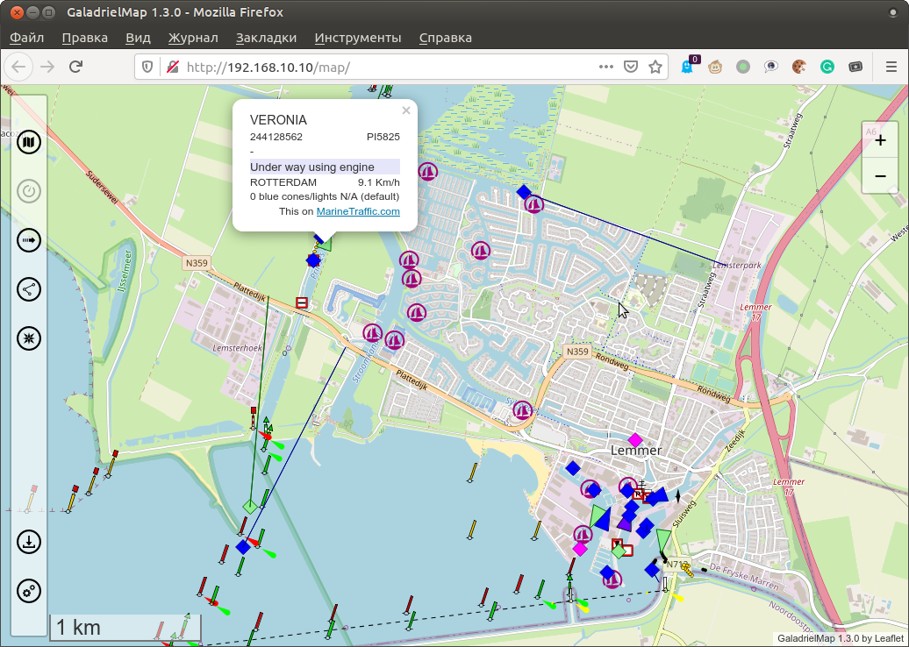
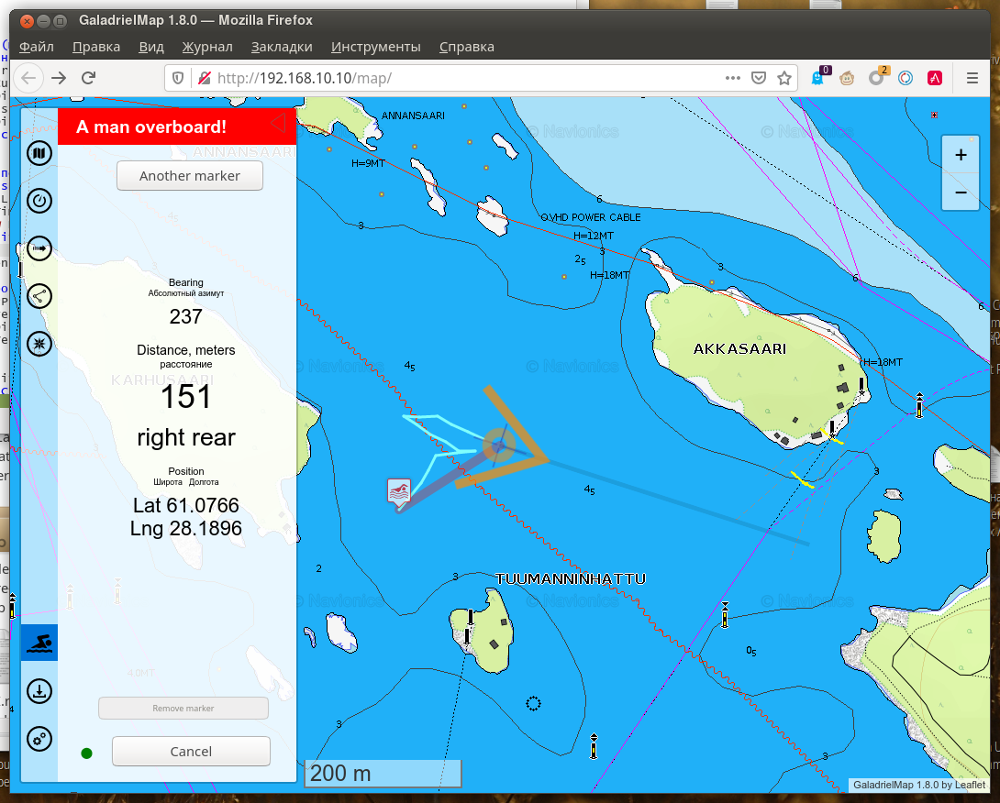

# GaladrielMap 
This a server-based chart plotter navigation software for pleasure crafts and off-road cars. The application can be placed on a weak server such as RaspberryPi, NAS or router and used on full clients such as tablets and smartphones. Only browser need.

## v. 1.9
 
Technically this an online tiles map viewer. With [GaladrielCache](https://github.com/VladimirKalachikhin/Galadriel-cache) -- this an offline viewer with tile grabbing features. It is assumed that the application is used in the onboard local area network of the boat or car. The author uses it from the [wi-fi router/GSM modem under OpenWRT](https://github.com/VladimirKalachikhin/MT7620_openwrt_firmware) as a server on his sailboat "Galadriel".  
**The author is not responsible for the consequences of using the GaladrielMap for navigation.**

The GaladrielMap created with use a lot of famous projects, so don't forget to install [dependenses](#dependences-and-thanks).  

## Features
1. [Online or offline user-defined maps](#maps)
2. [Positioning](#positioning) via [gpsd](https://gpsd.io/) or [Signal K](https://signalk.org/)
3. [Tracking](#tracking)
4. [Display routes and POIs](#routes-and-pois) files in gpx, kml and csv format
5. [Creating and edit a route](#creating-and-edit-a-route) localy and save it to the server in gpx format
6. [Exchange coordinates](#exchange-coordinates) via clipboard
7. [Weather forecast](#weather-forecast) from [Thomas Krüger Weather Service](http://weather.openportguide.de/index.php/en/)
8. [Display AIS info](display-ais-info)
9. [netAIS support](#netais)
10. [A Man OverBoard feature](a-man-overboard)
11. Optimised for E-Ink screens [Dashboard](#dashboard)
12. [Control the GaladrielCache Loader](#the-galadrielcache-loader)
13. English or Russian interface, dependent of browser language settings

## Compatibility
Linux. Modern browsers include mobile.

## Limitations
You may want to use some tcp streams as a data source in GaladrielMap. It's may be a stream from hardware instruments multiplexor or software multiplexor such as [Signal K](https://signalk.org/). Due to [gpsd](https://gpsd.io/) and [Signal K](https://signalk.org/) limitations data from tcp streams can be shown with some delay, and be not quite relevant. This does not apply to coordinates, velocity and heading. This data is always correct.  
This limitation applies only to tcp streams data sources for [gpsd](https://gpsd.io/) and [Signal K](https://signalk.org/) daemons. Devices, directly plugged to [gpsd](https://gpsd.io/) (or [Signal K](https://signalk.org/), if [Signal K](https://signalk.org/) used instead [gpsd](https://gpsd.io/), see [Positioning](#positioning)) displayed correctly.

## Demo
Full feature [live demo](http://130.61.159.53/map/). Sometimes there floating a virtual sailboat.

## Ready to use images
[Available](https://github.com/VladimirKalachikhin/GaladrielMap-Demo-image/blob/master/README.md) ready to use virtual machine disk image and Raspberry Pi bootable image. It's a fully configured Linux system with GaladrielMap, GaladrielCache, netAIS, gpsd, gpxlogger, etc. for test and builds own onboard server. 

## Install&configure:
You must have a web server under Linux with php support. Just copy app, dependences and set paths.  
Paths and other are set and describe in _params.php_

## Emergency kit
All you need to install, including dependences, are in _emergencykit/_.  
You may download full pack -- more 4MB, or without vector tiles support pack -- less them 1MB.

## Dependences and thanks
* [Leaflet](https://leafletjs.com/) in _leaflet/_ directory
* [Coordinate Parser](https://github.com/servant-of-god/coordinate-parser) in _coordinate-parserPATCHED/_ directory
* [L.TileLayer.Mercator](https://github.com/ScanEx/L.TileLayer.Mercator) as _L.TileLayer.Mercator/src/L.TileLayer.Mercator.js_
* [Leaflet.Editable](https://github.com/Leaflet/Leaflet.Editable) in _Leaflet.Editable/_ directory
* [Leaflet.RotatedMarker](https://github.com/bbecquet/Leaflet.RotatedMarker) as _Leaflet.RotatedMarker/leaflet.rotatedMarker.js_
* [Leaflet Measure Path](https://github.com/ProminentEdge/leaflet-measure-path) in _leaflet-measure-path/_ directory
* [leaflet-sidebar-v2](https://github.com/nickpeihl/leaflet-sidebar-v2) in _leaflet-sidebar-v2/_ directory
* [mapbox-gl-js](https://github.com/mapbox/mapbox-gl-js) in _mapbox-gl-js/dist/_ directory
* [mapbox-gl-leaflet](https://github.com/mapbox/mapbox-gl-leaflet) as _mapbox-gl-leaflet/leaflet-mapbox-gl.js_
* [supercluster](https://github.com/mapbox/supercluster) as _supercluster/supercluster.js_
* [gpsdPROXY](https://github.com/VladimirKalachikhin/gpsdPROXY) in _gpsdPROXY/_ directory

Create a local copy of dependences and/or edit _index.php_

## More thanks
* [leaflet-omnivore](https://github.com/mapbox/leaflet-omnivore) for leaflet-omnivore. This patched to show markers and non well-formed gpx files.
* [Metrize Icons by Alessio Atzeni](https://icon-icons.com/pack/Metrize-Icons/1130) for icons.
* [Typicons by Stephen Hutchings](https://icon-icons.com/pack/Typicons/1144) for icons.
* [Map Icons Collection](https://mapicons.mapsmarker.com/) for icons.
* [On/Off FlipSwitch](https://proto.io/freebies/onoff/)
* [leaflet-tracksymbol](https://github.com/lethexa/leaflet-tracksymbol) which became the basis for display AIS data
* [openmaptiles](https://github.com/openmaptiles/fonts) for Open Font Glyphs for GL Styles
* [GitHub MAPBOX project](https://github.com/mapbox) for navigation ui resources
* [OpenMapTiles](https://github.com/openmaptiles) for Mapbox GL basemap style
* [leaflet-ais-tracksymbol](https://github.com/PowerPan/leaflet-ais-tracksymbol) for ideas

## Maps
The GaladrielMap applies [OSM-style tiles map](https://wiki.openstreetmap.org/wiki/Tiles), both raster and vector. It can be one OSM- or mapbox-like on-line map or with [GaladrielCache](https://github.com/VladimirKalachikhin/Galadriel-cache) any number of stacked maps, online and offline.  
 
The map source is set in the  _params.php_, and if it is [GaladrielCache](https://github.com/VladimirKalachikhin/Galadriel-cache) (default), you have available any number of user-defined map sources. How to define a new map -- described in [GaladrielCache](https://github.com/VladimirKalachikhin/Galadriel-cache) project.  
At least, it include  
[Open Sea Map](http://www.openseamap.org/)  
[Open Topo Map](https://opentopomap.org/about)  
maps.

### Mapbox-style vector tiles maps
GaladrielMap has limited support the Mapbox-style vector tiles maps. [Mapbox style file](https://docs.mapbox.com/mapbox-gl-js/style-spec/) must be placed on `$mapSourcesDir` directory of the [GaladrielCache](https://github.com/VladimirKalachikhin/Galadriel-cache) with **{mapname}.json** name. (See [GaladrielCache](https://github.com/VladimirKalachikhin/Galadriel-cache) docs.) Sprites and glyphs you can find in _styles/_ directory.

## Positioning
  
 GaladrielMap gets realtime spatial data and other info via [gpsd](https://gpsd.io/). Usually enough plug a GNSS receiver to the server.  
How to install and configure gpsd see [gpsd pages](https://gpsd.io/).

Another way is to use [Signal K](https://signalk.org/) infrastructure. If no spatial info sources sets in _params.php_, GaladrielMap  will try found the Signal K service on your local network, and get a position from it.  
However, it is better to set the Signal K server address in _params.php_ if you are going to use Signal K.

Map **always** sets to current position. This behavior can be temporarily disabled on the  menu. Following the cursor is disabled if  or  menu are open.

## Tracking
GaladrielMap use `gpxlogger` app from gpsd-clients packet to logging track on your server. Control `gpxlogger` are in  tab.  
GaladrielMap displaying current track as a not well-formed gpx file. Other tracks may be displayed simultaneously.  
Run _chkGPXfiles.php_ in cli to repair non-well-formed gpx files for other applications.  
Tracks placed in _tracks_ directory on the server as it described in _params.php_.  
Installation and configuring the `gpxlogger` described in  [gpsd](https://gpsd.io/) documentation. You may use any other server-side logger for tracking in gpx format, set up it in _params.php_.

## Routes and POIs
  
 GaladrielMap display routes and PointOfInterest on gpx, kml and csv formats. Place you routes and POIs files to _route_ directory on the server as it directory described in _params.php_. Open  tab.
### CSV
Comma-Separated Values text file - the simplest way of cooking personal POI for your trip. Only text editor needed. But, to avoid mistakes, any spreadsheet recommended.  
The first line in the CSV file must be field names. Good choice is a `"number","name","description","type","link","latitude","longitude"`  
Latitude and longitude may be in degrees, minutes and seconds, 61°04.7'N for example, or in decimal degrees.
A real example of using CSV to store information about ports and piers on Lake Saimaa in Finland - [SaimaaPOI](https://github.com/VladimirKalachikhin/Saimaa-POI). File with geospatial photolinks on CSV format - is a good example too.  
Place your CSV to _route_ directory on the server as it directory described in _params.php_. Avoid setting file names in _route_ same as names in _tracks_ directory.

## Creating and edit a route
  
Open  tab to navigational plotting feature. You can create and edit a route on the local device, and/or save it to server to _route_ directory.  
 This feature includes a base gpx route editing tool. You can edit any gpx route from the server in the same way as local route, and save it under the same or new name. Displaying edited routes update automatically on all connected devices.  
 Good case for use -- navigational plotting by the navigator in a dry and warm booth for the steersman on the rain and wind.  
 But it is only a base gpx route editor. Gpx &lt;metadata&gt; not supported, and point &lt;extensions&gt; (GARMIN like it) not supported too. Be careful to edit and save exists gpx.  
 Also be careful with danger of unauthorized edit routes from guests and childrens. Disable the auto-update routes via _params.php_.  
 
For route planning, it is useful to find coordinates by geographical name or postal address, if there is an Internet connection, of course. And vice versa -- getting the nearest address for the screen centre. Use the input field for it.

## Exchange coordinates
To get current position to clipboard to share it via other apps - tap on Position on  tab.  
Also, tap on POI name on point's popup to get a position of this point.  
To get coordinates of any point - open  tab. Coordinates of crosshair will be in the input text field.  
To fly map by coordinates type they of any format to this field and press button.

## Weather forecast
  
If there is an Internet connection you can get the weather forecast from [Thomas Krüger Weather Service](http://weather.openportguide.de/index.php/en/).

## Display AIS info
 
GaladrielMap displayed AIS data via [gpsd](https://gpsd.io/). The gpsd may need additional set up to get AIS flow from AIC transmitters, but usually no need for additional set up to get data from the AIS receiver.  
Displaying AIS data is disabled by default, so you must enable it by uncomment string with $aisServerURI variable in _params.php_.  

## netAIS support
 
The [netAIS](https://github.com/VladimirKalachikhin/netAIS) is the local service to exchange position information inside of a private group via internet.  
GaladrielMap displayed full netAIS info, include text messages.  
For example, three members of the same private group see each other on its screens.

## A Man OverBoard
 
Sets marker, stretches the line to and indicates distance and direction to MOB just by open tab.  
Tap to  opens MOB tab and start MOB mode. Track logging turned on, positions the MOB markers saved to the server. You may add new markers and dragging markers to a new position. Tap to marker to select it for stretches the direction line to. Tap on indication of MOB position copies it to clipboard.  
MOB information spreading to all connected devices and may edit from any of this.  
To finalize MOB mode tap to the dot left of the "Terminate" button first.  

## Dashboard
 _dashboard.php_ - the separate app to display some instruments attached to gpsd, on weak (and/or old) devices, such as E-ink readers, for example. Displayed velocity, depth and true and magnetic heading.  
Instruments from Signal K not displayed.  
  
  
  
 The Dashboard allows you to set a signal for dangerous events, such as shallow or speed. Set up your browser to allow sound signal.  
  
 No fanciful javascript, no fanciful css.  

## The GaladrielCache Loader
  
Sets region, start loader, watch the progress. The loader runs on the server, so it autonomous and robust. Loader restart after server reboot and it will work until it finishes.  
For see of loaded tiles use coverage switch.
 

## Support

[Discussions](https://github.com/VladimirKalachikhin/Galadriel-map/discussions)

You can get support for GaladrielMap and GaladrielCahe for a beer [via PayPal](https://paypal.me/VladimirKalachikhin) or [YandexMoney](https://yasobe.ru/na/galadrielmap) at [galadrielmap@gmail.com](mailto:galadrielmap@gmail.com)  
