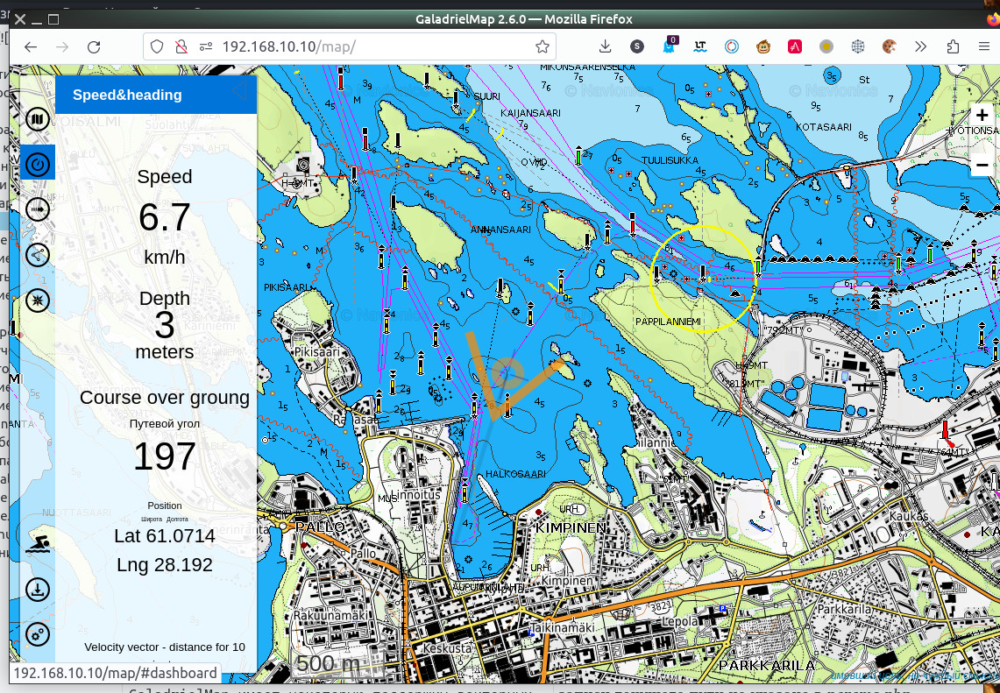
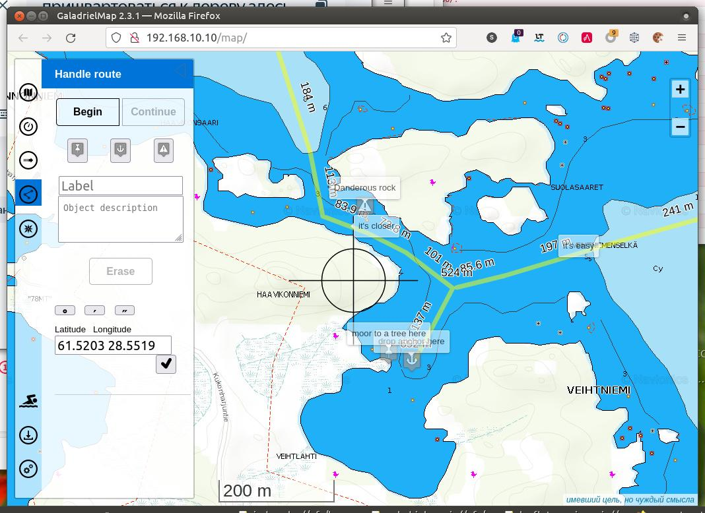
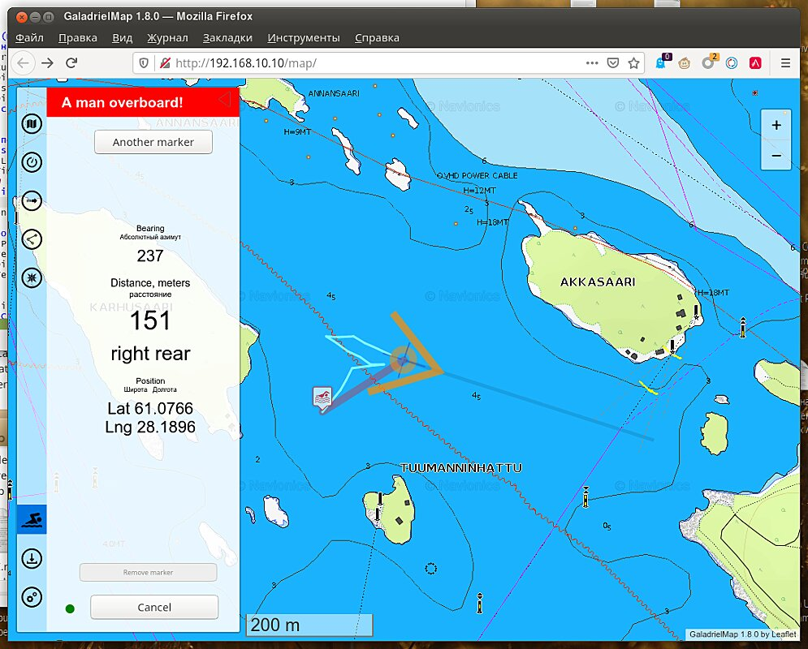

[Русское описание](https://github.com/VladimirKalachikhin/Galadriel-map/blob/master/README.ru-RU.md)  
# GaladrielMap [](https://creativecommons.org/licenses/by-sa/4.0/)
This is a server-based chart plotter navigation software for pleasure crafts, motorhomes, and off-road cars. The application can be placed on a weak server such as RaspberryPi, NAS or router and used on full clients such as tablets and smartphones. Only browser need.
<div style='float:right;'><a href='https://github.com/VladimirKalachikhin/Galadriel-map/discussions'>Forum</a>
</div>

## v. 2.9
<br>
Technically this an online tiles map viewer. With [GaladrielCache](https://github.com/VladimirKalachikhin/Galadriel-cache) -- this an offline viewer with tile grabbing features. It is assumed that the application is used in the onboard local area network of the boat or car. The author uses it from the [wi-fi router/GSM modem under OpenWRT](https://github.com/VladimirKalachikhin/MT7620_openwrt_firmware) as a server on his sailboat "Galadriel".  

**The author is not responsible for the consequences of using the GaladrielMap for navigation. It is not guaranteed that any of the information on the screen is correct, including but not limited to spatial position, speed, depth, and direction of movement.**

The GaladrielMap created with use a lot of famous projects, so don't forget to install [dependenses](#dependences-and-thanks).  


## Features
1. [Online or offline user-defined maps](#maps)
2. [Positioning](#positioning) with GNSS receivers
3. [Tracking](#tracking)
4. [Display routes and POIs](#routes-and-pois) files in gpx, kml and csv format
5. [Creating and edit a route](#creating-and-edit-a-route) localy and save it to the server in gpx format
6. [Exchange coordinates](#exchange-coordinates) via clipboard
7. [Weather forecast](#weather-forecast) from [Thomas Krüger Weather Service](http://weather.openportguide.de/index.php/en/)
8. [Display AIS info](display-ais-info)
9. [Collision detection](#collision-detection)
10. [netAIS support](#netais)
11. [A Man OverBoard feature](a-man-overboard)
12. Optimised for E-Ink screens [Dashboard](#dashboard)
13. [Control the GaladrielCache Loader](#the-galadrielcache-loader)
14. English or Russian interface, dependent of browser language settings


* [Work on OpenWRT](#work-in-openwrt)
* [Work on VenusOS](#work-in-venusos)

 [Support](#support)


## Compatibility
PHP7, Linux, OpenWRT, VenusOS. Modern browsers include mobile.


## Demo
~~Full feature [live demo](http://130.61.159.53/map/). Sometimes there floating a virtual sailboat.~~ 
Unfortunately, the Oracle Inc. turned out to be a crook, so the demo does not work.


## Ready to use images
[Available](https://github.com/VladimirKalachikhin/GaladrielMap-Demo-image/blob/master/README.md) ready to use virtual machine disk image and Raspberry Pi bootable image. It's a fully configured Linux system with GaladrielMap, GaladrielCache, netAIS, gpsd, gpxlogger, etc. for test and builds own onboard server. 


## Install&configure:
You must have a web server under Linux with web server and php <8 support. Just copy app, dependences and set paths.  
Paths and other are set and describe in _params.php_  
More detailed instructions are available in _emergencykit/_ directory.


## Emergency kit
All you need to install, including dependences, are in _emergencykit/_.  See README.txt how to install.
You may download full pack -- more 10MB, or without vector tiles support and screenshots pack -- less them 3MB.


## Dependences and thanks
* [Leaflet](https://leafletjs.com/) < 1.8 in _leaflet/_ directory
* [Coordinate Parser](https://github.com/servant-of-god/coordinate-parser) in _coordinate-parserPATCHED/_ directory
* [L.TileLayer.Mercator](https://github.com/ScanEx/L.TileLayer.Mercator) as _L.TileLayer.Mercator/src/L.TileLayer.Mercator.js_
* [Leaflet.Editable](https://github.com/Leaflet/Leaflet.Editable) in _Leaflet.Editable/_ directory
* [Leaflet.RotatedMarker](https://github.com/bbecquet/Leaflet.RotatedMarker) as _Leaflet.RotatedMarker/leaflet.rotatedMarker.js_
* [Leaflet Measure Path](https://github.com/ProminentEdge/leaflet-measure-path) in _leaflet-measure-path/_ directory
* [leaflet-sidebar-v2](https://github.com/nickpeihl/leaflet-sidebar-v2) in _leaflet-sidebar-v2/_ directory
* [mapbox-gl-js](https://github.com/mapbox/mapbox-gl-js) in _mapbox-gl-js/dist/_ directory
* [mapbox-gl-leaflet](https://github.com/mapbox/mapbox-gl-leaflet) as _mapbox-gl-leaflet/leaflet-mapbox-gl.js_
* [supercluster](https://github.com/mapbox/supercluster) as _supercluster/dist/supercluster.js_
* [gpsdPROXY](https://github.com/VladimirKalachikhin/gpsdPROXY) in _gpsdPROXY/_ directory
* [polycolorRenderer](https://github.com/VladimirKalachikhin/polycolorRenderer) in _polycolor/_ directory  
* [value2color](https://github.com/VladimirKalachikhin/value2color) in _value2color/_ directory  
* [long-press-event](https://github.com/john-doherty/long-press-event) as _long-press-event/dist/long-press-event.min.js_

Create a local copy of dependences and/or edit _index.php_


## More thanks
* [leaflet-omnivore](https://github.com/mapbox/leaflet-omnivore) for leaflet-omnivore. This patched to show markers, non well-formed gpx files and more.
* [Metrize Icons by Alessio Atzeni](https://icon-icons.com/pack/Metrize-Icons/1130) for icons.
* [Typicons by Stephen Hutchings](https://icon-icons.com/pack/Typicons/1144) for icons.
* [Map Icons Collection](https://mapicons.mapsmarker.com/) for icons.
* [On/Off FlipSwitch](https://proto.io/freebies/onoff/)
* [leaflet-tracksymbol](https://github.com/lethexa/leaflet-tracksymbol) which became the basis for display AIS data
* [openmaptiles](https://github.com/openmaptiles/fonts) for Open Font Glyphs for GL Styles
* [GitHub MAPBOX project](https://github.com/mapbox) for navigation ui resources
* [OpenMapTiles](https://github.com/openmaptiles) for Mapbox GL basemap style
* [leaflet-ais-tracksymbol](https://github.com/PowerPan/leaflet-ais-tracksymbol) for ideas


## Maps
The GaladrielMap applies [OSM-style tiles map](https://wiki.openstreetmap.org/wiki/Tiles), both raster and vector. It can be one OSM- or mapbox-like on-line map or with [GaladrielCache](https://github.com/VladimirKalachikhin/Galadriel-cache) any number of stacked maps, online and offline.  
<br>
The map source is set in the  _params.php_, and if it is [GaladrielCache](https://github.com/VladimirKalachikhin/Galadriel-cache) (default), you have available any number of user-defined map sources. How to define a new map -- described in [GaladrielCache](https://github.com/VladimirKalachikhin/Galadriel-cache) project.  
At least, it include  
[Open Sea Map](http://www.openseamap.org/)  
[Open Topo Map](https://opentopomap.org/about)  
maps.  
The right way is to select a little lot of favourite maps (by long-click or right-swap) from all maps in map list. This makes it easy to switch between them. 

### Mapbox-style vector tiles maps
GaladrielMap has limited support the Mapbox-style vector tiles maps. [Mapbox style file](https://docs.mapbox.com/mapbox-gl-js/style-spec/) must be placed on `$mapSourcesDir` directory of the [GaladrielCache](https://github.com/VladimirKalachikhin/Galadriel-cache) with **{mapname}.json** name. (See [GaladrielCache](https://github.com/VladimirKalachikhin/Galadriel-cache) docs.) Sprites and glyphs you can find in _styles/_ directory.


## Positioning
 <br>
 GaladrielMap gets realtime spatial data and other info via [gpsd](https://gpsd.io/). Usually enough plug a GNSS receiver to the server.  
How to install and configure gpsd see [gpsd pages](https://gpsd.io/).  
Also, GaladrielMap can get data from VenusOS or Signal K - localy or via LAN. If GaladrielMap don't find **gpsd**, it it tries to discover Signal K and then VenusOS on LAN and takes the data from there.

Map **always** sets to current position. This behavior can be temporarily disabled on the  menu. Following the cursor is disabled if  or  menu are open.  
The position cursor indicates **heading**, and velocity vector indicates **course**, if both parameters are available from a data source. If there is one, then they show the same, and what exactly is indicated on the  dashboard.

## Tracking
GaladrielMap uses `gpxlogger` app from the gpsd-clients packet to log track on your server. Control `gpxlogger` are in  tab.  
GaladrielMap displays the current track as a not well-formed gpx file. Other tracks may be displayed simultaneously.  
Run _chkGPXfiles.php_ in cli to repair non-well-formed gpx files for other applications.  
Tracks placed in _tracks_ directory on the server as it described in _params.php_.  
Installation and configuring the `gpxlogger` describe in  [gpsd](https://gpsd.io/) documentation. You may use any other server-side logger for tracking in gpx format, set up it in _params.php_. If not - the logged track will still be updated if its name will be recognized as "current track" (see _params.php_).  

## Routes and POIs
 <br>
 GaladrielMap display tracks, routes and PointOfInterest on gpx, kml and csv formats. Place you routes and POIs files to _route_ directory on the server as it directory described in _params.php_. Open  tab.  
If there is depth in the gpx track, it can be shown by color along line (see _params.php_).

### CSV
Comma-Separated Values text file - the simplest way of cooking personal POI for your trip. Only text editor needed. But, to avoid mistakes, any spreadsheet recommended.  
The first line in the CSV file must be field names. Good choice is a   `"number","name","description","type","link","latitude","longitude"`  
as the [_gpsbabel_ doc](https://www.gpsbabel.org/htmldoc-1.7.0/fmt_unicsv.html) recommends.  
Latitude and longitude may be in degrees, minutes and seconds, 61°04.7'N for example, or in decimal degrees.
A real example of using CSV to store information about ports and piers on Lake Saimaa in Finland - [SaimaaPOI](https://github.com/VladimirKalachikhin/Saimaa-POI). File with geospatial photolinks on CSV format - is a good example too.  
Place your CSV to _route_ directory on the server as it directory described in _params.php_. Avoid setting file names in _route_ same as names in _tracks_ directory.


## Creating and edit a route
 <br>
Open  tab to navigational plotting feature. You can create and edit a route and waypoints on the local device, and/or save it to server to _route_ directory.  
 This feature includes a base gpx route editing tool. You can edit any gpx route from the server in the same way as local route, and save it under the same or new name. Displaying edited routes update automatically on all connected devices.  
 Good case for use -- navigational plotting by the navigator in a dry and warm booth for the steersman on the rain and wind.  
 But it is only a base gpx route editor. Gpx &lt;metadata&gt; not supported, and point &lt;extensions&gt; (GARMIN like it) not supported too. Be careful to edit and save exists gpx.  
 Also be careful with danger of unauthorized edit routes from guests and childrens. Disable the auto-update routes via _params.php_.  
 
For route planning, it is useful to find coordinates by geographical name or postal address, if there is an Internet connection, of course. And vice versa -- getting the nearest address for the screen centre. Use the input field for it.


## Exchange coordinates
To get current position to clipboard to share it via other apps - tap on Position on  tab.  
Also, tap on POI name on point's popup to get a position of this point.  
To get coordinates of any point - open  tab. Coordinates of crosshair will be in the input text field.  
To fly map by coordinates type they of any format to this field and press button.


## Weather forecast
 <br>
If there is an Internet connection you can get the weather forecast from [Thomas Krüger Weather Service](http://weather.openportguide.de/index.php/en/).


## Display AIS info
<br>
The GaladrielMap displayed AIS data via [gpsdPROXY](https://github.com/VladimirKalachikhin/gpsdPROXY) from [gpsd](https://gpsd.io/) or directly from [Signal K](https://signalk.org/). The gpsd may need additional set up to get AIS flow from AIC transmitters, but usually no need for additional set up to get data from the AIS receiver.  
Displaying AIS data is disabled by default, so you must enable it by uncomment string with $aisServerURI variable in _params.php_. To temporarily disable displaying AIS data use switch in  menu.  
As displaying AIS data from gpsd need gpsdPROXY, you MUST use gpsdPROXY as position data service. Set up $gpsdHost and $gpsdPort variables in _params.php_ to this.

## Collision detection
<br>  
The GaladrielMap shows information on possible collisions calculated by the gpsdPROXY. Potentially dangerous objects are highlighted and their direction is indicated by an arrow.  
Do not rely too much on the collision detection system. Remember that **no information issued or not issued by the collision detection system can be the basis for the actions or inaction of the navigator.** Be careful.

## netAIS support
<br>
The [netAIS](https://github.com/VladimirKalachikhin/netAIS) is the local service to exchange position information inside of a private group via internet.  
GaladrielMap displayed full netAIS info, include text messages.  
For example, three members of the same private group see each other on its screens.


## A Man OverBoard
<br>
Sets marker, stretches the line to and indicates distance and direction to MOB just by open tab.  
Tap to  opens MOB tab and start MOB mode. Track logging turned on, positions the MOB markers saved to the server. You may add new markers and dragging markers to a new position. Tap to marker to select it for stretches the direction line to. Tap on indication of MOB position copies it to clipboard.  
MOB information spreading to all connected devices and may edit from any of this.  
To finalize MOB mode tap to the dot left of the "Terminate" button first.  


## Dashboard
_dashboard.php_ - the separate app to display some instruments attached to gpsd, on weak (and/or old) devices, such as e-ink readers, for example.  
Instruments from Signal K not displayed.  
<br>
<br>

[Live demo](http://130.61.159.53/map/dashboard.php)

The screen image optimized to different screen resolutions and should look good from little to big screens. Displayed velocity, depth and true and magnetic heading. You can use two or more devices to display different info. At the border of the screen is always visible the mark with general direction.  
The Dashboard allows you to set a visual and sound signal for dangerous events, such as shallow or speed.  
<br>
Set up your browser to allow sound signal.  
The signal settings are local for every showing device, and it is triggered only if the device work. Be careful!  
If the course alarm is set, the set and current direction are displayed at the border of the screen as triangle and dash marks:  
<br>
When deviating from the course the visual and sound alarm fired:
<br>

The presence of the touch screen is assumed, and mode is switched by a tap to the next data type button on the screen.  
For some devices with JavaScript you may set up some hardware keys to switch mode, magnetic or true course and opening alarm menu. Use  button on bottom of alarm menu to set up it. Default keys is:

* ArrowDown for next mode
* ArrowUp for previous mode
* AltRight for alarm menu
* KeyM for magnetic course switch
 
No fanciful javascript, no fanciful css.  
Highly recommended to use [gpsdPROXY](https://github.com/VladimirKalachikhin/gpsdPROXY) if you want to see data other them velocity.


## The GaladrielCache Loader
<br>
Choose a region by specifying tile numbers by hand in the panel or by tap on tile number on the map. After tap the Ok button to  start loader.  
All displayed maps will be loaded from the current zoom to the maximum zoom. The loader runs on the server, so it autonomous and robust. Loader restart after server reboot and it will work until it finishes.  
For see of loaded tiles use coverage switch. 

## Work in OpenWRT
On powerful computers (Raspbery Pi, yes) on OpenWRT installation and startup of GaladrielMap are performed in the same way as on common Linux.  
On routers usually need custom firmware if the capacity of the built-in drive is insufficient. For example, [MT7620A based router OpenWRT firmware ](https://github.com/VladimirKalachikhin/MT7620_openwrt_firmware) for run GaladrielMap.
### System configuration
There is only one full user in the OpenWRT - _root_. But if you (at least) use php-fpm, the web server is running from _nobody_ by default. Therefore, some functions of GaladrielMap, such as fail-safe, will not work. Is necessary that the web server also works from root. 
For this:  
Edit `/etc/php7-fpm.d/www.conf`:  
```
;user = nobody
user = root
```
Edit `/etc/init.d/php7-fpm`:
```
#PROG="/usr/bin/php-fpm"
PROG="/usr/bin/php-fpm -R"
```
Reboot

## Work in VenusOS
The GaladrielMap mostly can work in VenusOS v2.80~38 or above. Or get data from it in LAN. To do this, you need:

* install php-cli. Run in ssh console:  

```
opkg update  
opkg install php-cli  
```

* enable "MQTT on LAN" feature. On VenusOS web remote console go Settings -> Services -> MQTT on LAN (SSL) and Enable.
* Have enough i-nodes on SD card for tiles.

### limitations
* VenusOS does not provide depth and AIS services.
* VenusOS does not provide track log service.
* VenusOS does not provide Tor service, so to avoid the tile loader ban and for netAIS raise the Tor on other computer.
* The data provided by VenusOS are not reliable enough, so be careful.
* It may be necessary to configure the system as described for OpenWRT.


## Support

[Discussions](https://github.com/VladimirKalachikhin/Galadriel-map/discussions)

The forum will be more lively if you make a donation at [ЮMoney](https://sobe.ru/na/galadrielmap)

### On paid
[Personal consulting](https://kwork.ru/it-support/20093939/galadrielmap-installation-configuration-and-usage-consulting)  

Available Raspberry Pi bootable image with Raspbian, OpenWRT or VenusOS. Image include GaladrielMap with GaladrielCache and netAIS (except VenusOS, this not have workable netAIS) and ready to use. You can also order burn image to SD card the capacity you need. Contact  [galadrielmap@gmail.com](mailto:galadrielmap@gmail.com) 

It is possible to order WiFi router/internet access point with OpenWRT (such as [MT7620A based router](https://github.com/VladimirKalachikhin/MT7620_openwrt_firmware) or other) with fully configured and ready to use GaladrielMap. Contact  [galadrielmap@gmail.com](mailto:galadrielmap@gmail.com) 

