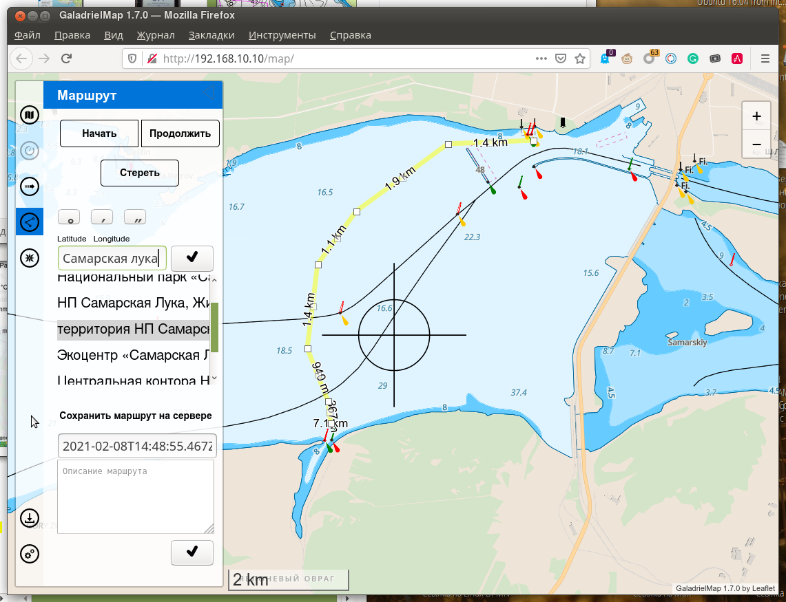
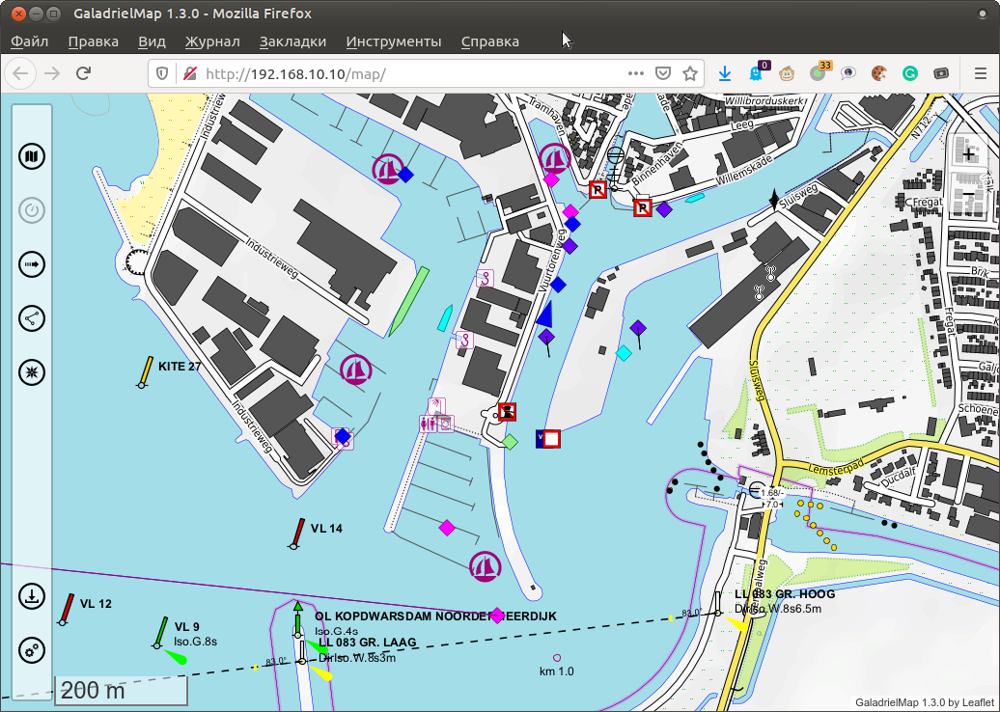
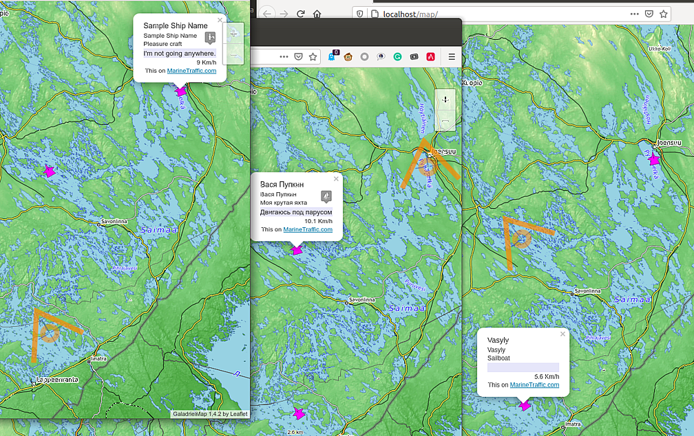
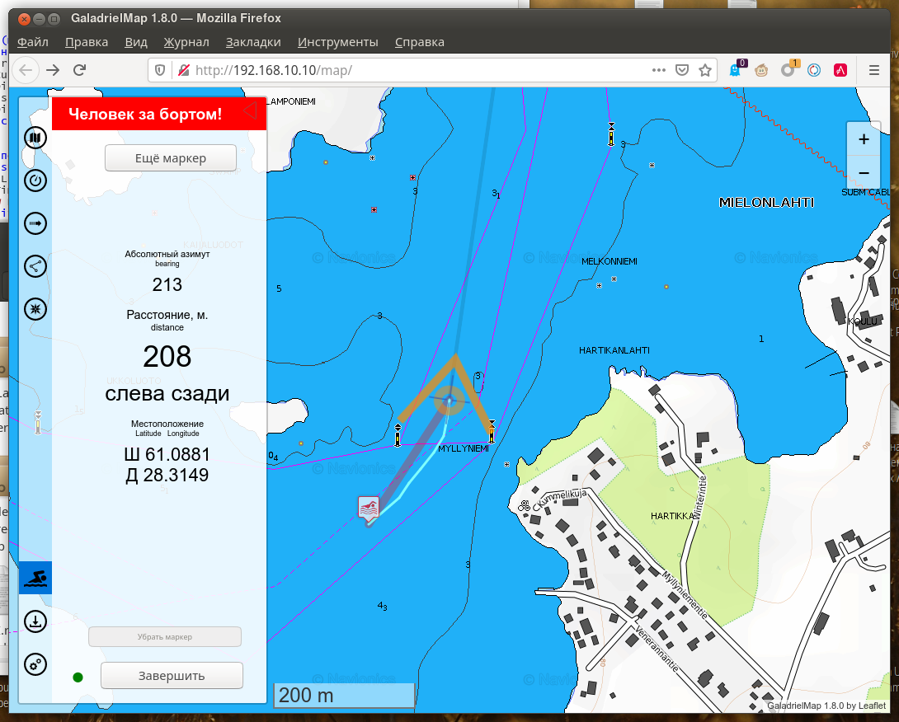
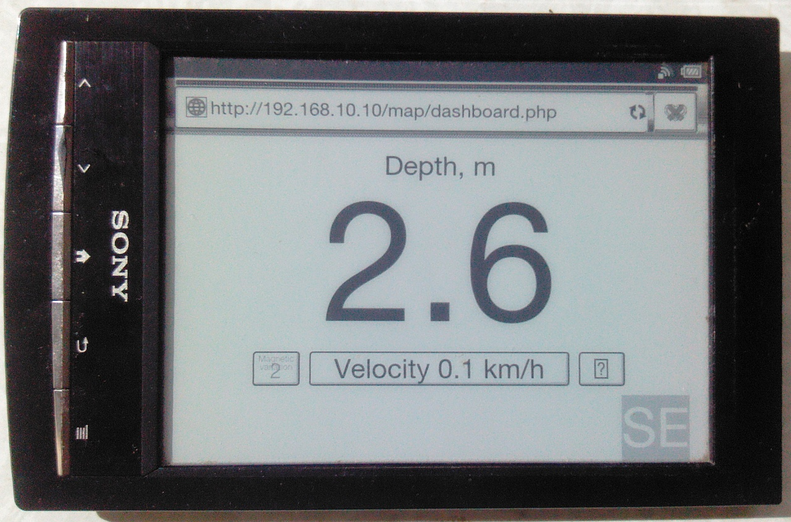
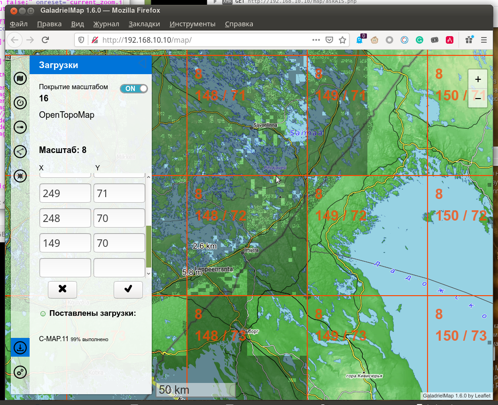

# GaladrielMap [](https://creativecommons.org/licenses/by-sa/4.0/)
Простой картплоттер (навигационно-картографическая система), ориентированный на любительское использование на маломерных судах.  
Приложение может быть размещено на слабом сервере типа  RaspberryPi, NAS или сетевом маршрутизаторе и предполагает использование с достаточно производительных клиентских устройств, преимущественно мобильных. Желательно применять планшет с большим экраном, однако пользоваться с телефона тоже вполне возможно. На клиентском устройстве требуется только наличие браузера -- никаких приложений устанавливать не нужно.

<br>
## v. 1.8
 <br>
Технически это веб-приложение -- просмотрщик тайловых онлайн карт. При использовании с  [GaladrielCache](https://github.com/VladimirKalachikhin/Galadriel-cache) становится возможным предварительное скачивание и последующий просмотр карт без подключения к сети Интернет.  
Предполагается, что приложение функционирует в  бортовой сети катера, яхты или автомобиля, поэтому никакого разграничения доступа к функциям не предусмотрено.
Автор пользуется GaladrielMap на своей яхте Galadriel, где в качестве сервера применяется [wi-fi маршрутизатор под управлением OpenWRT](https://github.com/VladimirKalachikhin/MT7620_openwrt_firmware) .   

**Внимание! Автор не несёт никакой ответственности за последствия использования GaladrielMap для навигации!** 

Приложение GaladrielMap создано на основе  замечательных проектов многих, без сомнения, выдающихся авторов, поэтому необходимо вручную установить большое количество [зависимостей](#зависимости-и-благодарности).  

<br>
## Возможности:
1. [Конфигурируемые пользователем локальные или сетевые карты](#карты)
2. [Отображение положения](#отображение-положения)
3. [Запись пути](#текущий-путь)
4. [Отображение маршрутов](#отображение-маршрутов), путевых точек и точек достопримечательностей
5. [Создание и редактирование маршрута](#создание-и-редактирование маршрута)
6. [Ввод и получение координат](#ввод-и-получение-координат)
7. [Прогноз погоды](#прогноз-погоды) от  [Thomas Krüger Weather Service](http://weather.openportguide.de/index.php/en/)
8. [Отображение информации AIS](#отображение-информации-ais)
9. [Поддержка netAIS](#поддержка-netais)
10. [Режим "Человек за бортом!"](#"человек-за-бортом!")
11. Отдельная [приборная панель](#приборная-панель), оптимизированная для устройств с экраном на "электронных чернилах" (E-Ink)
12. [Управление скачиванием карт](#загрузчик-galadrielcache)
13. Русский и английский интерфейс

<br>
## Совместимость
Требуется Linux на сервере и более-менее современный браузер на клиентском устройстве.

<br>
## Демо
Общедоступная [демонстрация](http://130.61.159.53/map/) позволяет ознакомиться с функциональностью и оценить удобство. Там иногда плавает виртуальный кораблик.

<br>
## Готовые образы машин
[Имется](https://github.com/VladimirKalachikhin/GaladrielMap-Demo-image/blob/master/README.ru-RU.md) настроенный и готовый к запуску образ виртуальной машины в общепринятом формате, а также загрузочный образ для Raspberry Pi, также настроенный и готовый к работе с первого запуска. Образы содержат GaladrielMap, GaladrielCache, netAIS, gpsd, gpxlogger и всё остальное, что необходимо для функционирования полноценного бортового сервера.

<br>
## Установка и конфигурирование:
Требуется веб-сервер под управлением Linux с поддержкой php. Скопируйте приложение и установите указанные ниже зависимости в желаемое место на веб-сервере.  
Укажите пути и другие параметры в _params.php_

<br>
## Аварийный набор
Однако, всё, что необходимо для установки приложения, включая зависимости, находится в архиве в каталоге  _emergencykit/_. Нужно просто распаковать.  
Можно скачать комплект без поддержки векторных тайлов (без шрифтов, значков и библиотек) -- его размер менее 1MB, или полный комплект -- размером более 4MB.

<br>
## Зависимости и благодарности
* [Leaflet](https://leafletjs.com/), установленная в каталог _leaflet/_ 
* [Coordinate Parser](https://github.com/servant-of-god/coordinate-parser) установленный в каталог _coordinate-parserPATCHED/_ 
* [L.TileLayer.Mercator](https://github.com/ScanEx/L.TileLayer.Mercator) установленная как _L.TileLayer.Mercator/src/L.TileLayer.Mercator.js_
* [Leaflet.Editable](https://github.com/Leaflet/Leaflet.Editable) установленная в каталог _Leaflet.Editable/_ 
* [Leaflet.RotatedMarker](https://github.com/bbecquet/Leaflet.RotatedMarker) установленная как _Leaflet.RotatedMarker/leaflet.rotatedMarker.js_
* [Leaflet Measure Path](https://github.com/ProminentEdge/leaflet-measure-path) установленная в каталог _leaflet-measure-path/_ 
* [leaflet-sidebar-v2](https://github.com/nickpeihl/leaflet-sidebar-v2) установленный в каталог _leaflet-sidebar-v2/_ 
* [supercluster](https://github.com/mapbox/supercluster) установленный как _supercluster/supercluster.js_
* [gpsdAISd](https://github.com/VladimirKalachikhin/gpsdAISd) в каталоге _gpsdAISd/_ 
* [mapbox-gl-js](https://github.com/mapbox/mapbox-gl-js) установленная в каталог _mapbox-gl-js/dist/_ 
* [mapbox-gl-leaflet](https://github.com/mapbox/mapbox-gl-leaflet) установленная как _mapbox-gl-leaflet/leaflet-mapbox-gl.js_

Для установки зависимостей нужно сделать локальную копию каждого проекта в каталоге приложения так, как это описано на сайте проекта, а потом, при необходимости, откорректировать пути в _index.php_

<br>
## Ещё благодарности
* [leaflet-omnivore](https://github.com/mapbox/leaflet-omnivore) за leaflet-omnivore. Этот продукт вдохновил на обширные усовершенствования.
* [Metrize Icons by Alessio Atzeni](https://icon-icons.com/pack/Metrize-Icons/1130) за использованные значки.
* [Typicons by Stephen Hutchings](https://icon-icons.com/pack/Typicons/1144) за использованные значки.
* [Map Icons Collection](https://mapicons.mapsmarker.com/) за использованные значки.
* [On/Off FlipSwitch](https://proto.io/freebies/onoff/)
* [leaflet-tracksymbol](https://github.com/lethexa/leaflet-tracksymbol) на основе которого сделано отображение данных AIS
* [openmaptiles](https://github.com/openmaptiles/fonts) за Open Font Glyphs for GL Styles
* [GitHub MAPBOX project](https://github.com/mapbox) за навигационные значки
* [OpenMapTiles](https://github.com/openmaptiles) за Mapbox GL basemap style
* [leaflet-ais-tracksymbol](https://github.com/PowerPan/leaflet-ais-tracksymbol) , откуда позаимствованы идеи и немножко кода

<br>
## Карты
В GaladrielMap используются [тайловые карты](https://wiki.openstreetmap.org/wiki/Tiles) в разграфке, принятой для [OSM](https://wiki.openstreetmap.org). Основной формат -- растровые тайлы, но могут быть использованы и векторные тайлы в формате [Mapbox](https://www.mapbox.com/).  
<br>
В сочетании с [GaladrielCache](https://github.com/VladimirKalachikhin/Galadriel-cache) (что предполагается по-умолчанию) одновременно может быть показано любой число карт, наложенных друг на друга (география + гидрография + погода, например) из сети Интернет и/или из локального хранилища.  
Конфигурация карт определяется пользоватетем и описана в документации к [GaladrielCache](https://github.com/VladimirKalachikhin/Galadriel-cache). Как минимум, среди карт уже есть [Open Sea Map](http://www.openseamap.org/) и [Open Topo Map](https://opentopomap.org/about).

### Векторные тайлы
GaladrielMap имеет некоторую поддержку векторных тайлов в формате [Mapbox](https://www.mapbox.com/). Такие карты могут отображаться.  
Описывающий карту файл[Mapbox style](https://docs.mapbox.com/mapbox-gl-js/style-spec/) должен находиться в каталоге `$mapSourcesDir` GaladrielCache, и называться также, как файл источника карты, но с расширением **.json**. В файле Mapbox style можно использовать значки и шрифты (Sprites and glyphs) из каталога _styles/_ .

<br>
## Отображение положения
GaladrielMap получает координаты, скорость, направление от работающего на сервере сервиса [gpsd](https://gpsd.io/).  
 <br>
 Установка и конфигурирование gpsd описаны в [документации к gpsd](https://gpsd.io/). Обычно никакой настройки не требуется: достаточно просто подсоединить приёмник ГПС в гнездо usb, и координаты начнут отображаться в GaladrielMap.  
 Если координаты имеются -- карта **всегда** позиционируется на экране в соответсвии с текущим положением. Это поведение можно временно отключить в меню настроек .  
 Также следование за курсором отключается, если открыты панели  и .

<br>
## Текущий путь
GaladrielMap может показывать текущий путь по мере его записи.  
Для записи текущего пути на сервере используется приложение `gpxlogger`  из комплекта gpsd-clients, имеющегося в дистрибутивах, но устанавливаемого отдельно. Конфигурирование `gpxlogger` описано в документации к [gpsd](https://gpsd.io/).  Записью пути включается на вкладке .  
Вместо `gpxlogger` можно использовать любую другую работающую на сервере программу, записывающую текущий путь в формате gpx. Она указывается в файле настройки _params.php_.  
Если запись текущего пути внезапно прервалась, и на диске остался некорректный файл gpx, его можно поправить, запустив
```
php chkGPXfiles.php
```
Текущий путь записывается в папку _tracks_ (в папку, указанную в переменной $trackDir конфигурационного файла _params.php_).

<br>
## Отображение маршрутов
GaladrielMap показывает маршруты и точки достопримечательностей, записанные в форматах gpx, kml и csv:  
 <br>
 Файлы располагаются на сервере в папке _route_ (как она указана в файле конфигурации _params.php_). Откройте панель .
 
### CSV
Текстовый файл в формате Comma-Separated Values -- самый простой способ заранее подготовить список интересующих точек (POI) для предстоящего путешествия. Для создания такого файла нужен только текстовый редактор, хотя удобней будет любой табличный процессор.  
Первой строкой в csv файле должны быть наименования колонок. GaladrielMap понимает следующие наименования:  
`"number","name","description","type","link","latitude","longitude"`  
хотя минимально-полезный набор состоит из  
`"name","latitude","longitude"`  
В файле возможны и другие колонки, но информация из них, скорее всего, на карте показана не будет.  
Широту и долготу можно указывать почти в любом формате, как в градусах, минутах и секундах -- 61°04'50"N, например, так и в десятичных градусах.  
Примером реального использования файла csv для обмена информацией о маринах и природных стоянках на озере Сайма в Финляндии может быть начинание [SaimaaPOI](https://github.com/VladimirKalachikhin/Saimaa-POI). Там же имеется файл csv с точками фотографирования и с ссылками на фотографии.  
Файл с путевыми точками надо положить в папку _route_ на сервере (в папку, указанную в переменной $routeDir конфигурационного файла _params.php_). Следует избегать совпадений имён файлов в папках _route_ и _tracks_.

<br>
## Создание и редактирование маршрута
Планирование маршрута происходит на клиентском устройстве, при этом имеется возможностью сохранить маршрут на сервере в формате gpx.  
 <br>
Инструменты для планирования и редактирования маршрута находятся на панели . Созданный маршрут автоматически сохраняется на клиентском устройстве (и на выключенном), а на сервер сохраняется нажатием кнопки.  
Этот инструмент может быть использован и для редактирования существующего маршрута в формате gpx, загруженного с сервера через панель  . Если редактируемый маршрут показывается ещё на каком-то устройстве, то после сохранения на сервере он сразу отобразится на этом устройстве в изменённом виде.  
Это может быть полезно, если нужно из тёплой рубки уточнить маршрут находящемуся под ветром и дождём рулевому.  
Однако, инструмент имеет только самую базовую поддержку gpx. Так, &lt;metadata&gt; не поддерживаются, любимые GARMIN &lt;extensions&gt; не поддерживаются тоже. Поэтому следует быть осторожным при редактировании сторонних файлов gpx.  
Также следует проявлять осторожность (и отключить возможность автоматического обновления маршрутов в  _params.php_), если существует возможность неадекватного редактирования маршрута со стороны детей или гостей.

 При наличии Интернет можно искать объекты по географическому наименованию или почтовому адресу, и наоборот -- получить ближайшее к координатам центра экрана географическое название или адрес. Для этого воспользуйтесь текстовым полем ввода.
 
<br>
## Ввод и получение координат
Для получения текущего положения нажмите на цифры координат на панели  . Координаты будут скопированы в буфер обмена. Можно вставить их в sms, мессенджер или письмо.  
Аналогично, координаты маркированной точки на карте могут быть получены нажатим на наименование точки в всплывающем окне этой точки.

Получить координаты произвольной точки на карте можно, открыв панель . Координаты перекрестия будут отображаться в текстовом поле. Если же, наоборот, ввести в это поле какие-либо координаты (широту и долготу, почти в любом формате), и нажать кнопку рядом -- карта переместиться так, что перекрестие будет указывать в эту точку. Кнопки над текстовым полем помогут ввести знаки градусов и минут.
 
 <br>
## Прогноз погоды
Прогноз погоды от [Thomas Krüger Weather Service](http://weather.openportguide.de/index.php/en/)
 <br>
 На трое суток, с интервалом в 6 часов. Доступны сила ветра, давление, температура, осадки и волнение моря в любых сочетаниях.
 
 <br>
## Отображение информации AIS 
 <br>
 Сбор данных AIS осуществляется от [gpsd](https://gpsd.io/), которому может понадобится некоторая настройка для получения данных от приёмопередатчика AIS. Если же имеется только usb приёмник AIS -- никакой настройки не требуется.  
Получение информации AIS по умолчанию отключено. Его можно включить, раскомментировав строку с переменной $aisServerURI в файле _params.php_.
 
 <br>
## Поддержка netAIS
[netAIS](https://github.com/VladimirKalachikhin/netAIS/blob/master/README.ru-RU.md) -- сервис обмена информацией о местоположении через интернет. Обмен идёт внутри приватных групп, никаких централизованных серверов не нужно.  
<br>
GaladrielMap поддерживает все возможности сервиса, отображая и нестандартные статусы и текстовые сообщения.
 
 <br>
## "Человек за бортом!"
<br>
Нажатие на кнопку  включает режим "Человек за бортом!" При этом активируется запись маршрута, ставится маркер в точке нажатия на кнопку и на карте рисуется линия от текущего положения к точке маркера. Информация сохраняется на сервере. На открывшейся панели отображается направление и расстояние до маркера.  
Имеется возможность установить ещё маркеры и передвинуть существующие. Линия от текущего положения протягивается к последнему установленному маркеру или к тому, на который нажали.  
Информация "Человек за бортом!" и все её изменения распространяется на все подключенные компьютеры, и может быть изменена с любого из них.  
Для завершения режима "Человек за бортом!" нужно предварительно нажать на серую точку слева от кнопки.

<br>
## Приборная панель
 _dashboard.php_ -- отдельное приложение, предназначенное для показа некоторых имеющихся приборов на очень слабых и/или медленных клиентских устройствах. Например, на читалке электронных книг с E-ink экраном:
 <br>
 <br>
 <br>
Показывается истинная скорость, истинный или магнитный курс и глубина. Разумеется, соответствующие приборы должны быть подключены к [gpsd](https://gpsd.io/). Только с приёмником геопозиционирования доступны истинный курс и скорость.  
Можно выставить сигнализацию на глубину и скорость.  
<br>
 Необходимо указать в настройках браузера разрешение воспроизводить звук.  
Это приложение не использует никакого хитрого javascript и никаких замысловатых стилей.

<br>
## Загрузчик GaladrielCache   
 <br>
 Указывается регион для загрузки, после чего сформированное задание передаётся на сервер и там запускается загрузчик. Можно следить за прогрессом скачивания.  
 Загрузчик работает автономно, и переживёт выключение сервера -- после включения он запустится автоматически и будет работать до тех пор, пока не скачает всё указанное. Не указывайте пол-планеты: места на диске не хватит!  
Чтобы видеть, какие участки карты уже есть в кеше -- можно включить показ схемы покрытия.
 
<br>
## Поддержка
За чашку кофе [через ЯндексДеньги](https://yasobe.ru/na/galadrielmap) или [PayPal](https://paypal.me/VladimirKalachikhin?locale.x=ru_RU) можно получить консультации по адресу [galadrielmap@gmail.com](mailto:galadrielmap@gmail.com)  
